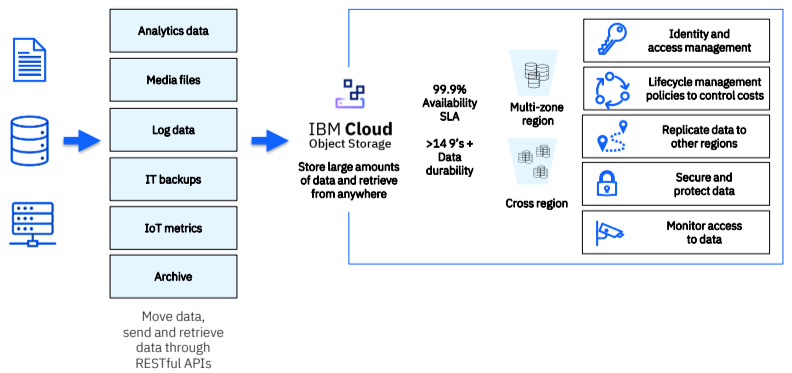
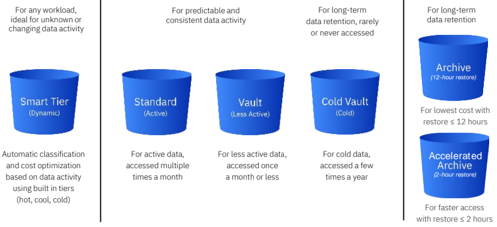
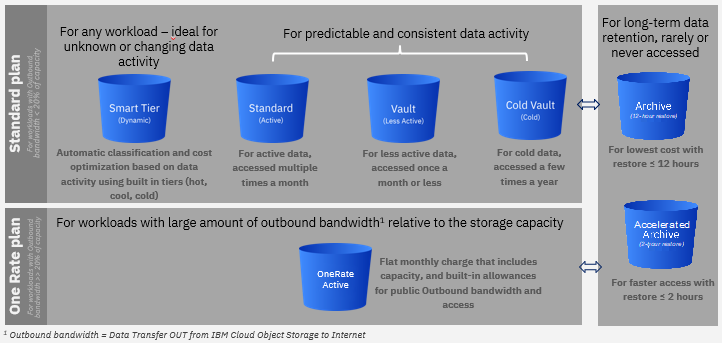
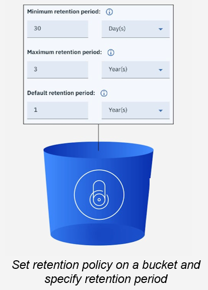
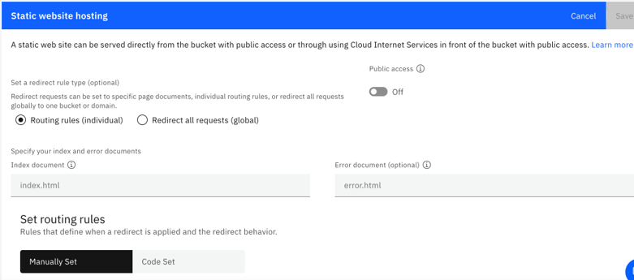
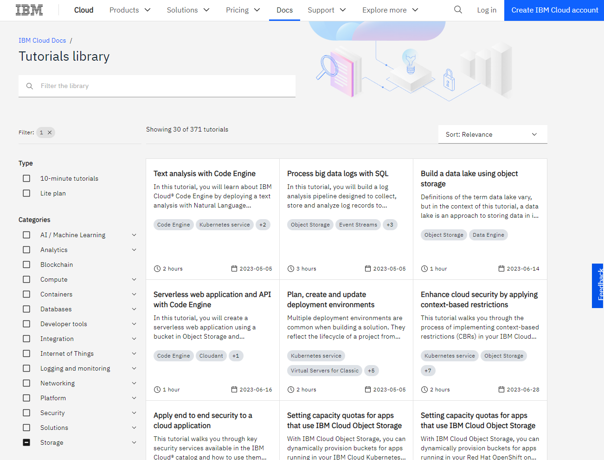

# IBM Cloud® Object Storage

**IBM Cloud Object Storage (COS)** stores encrypted and dispersed data across multiple geographic locations.

IBM Cloud Object Storage is an industry-leading cloud service ideal for storing large volumes of data. It provides best-in-class security and data durability at near-infinite scalability, complimented with immutable data retention, audit controls and continuous compliance - ideal for meeting the demands of your business and regulatory requirements.

IBM Cloud Object Storage supports exponential data growth for your cloud-native workloads with best-in-class cost optimization, robust data security and data governance with ease of use. Built-in data lifecycle operations also make it easy to observe and manage your critical workloads.

Store unlimted volume of data, such as images, videos and documents in any format. Store and access your data using industry standard S3 API, SDKs or the IBM Cloud user interface.

!!! key "Key value"

    Key differentiators:

    - Enterprise-ready [tiered storage](#tiered-storage)
    -[_One Rate plan_](#pricing) is a pricing option that includes out-bound network
    - [Data governance and security](#data-governance-and-security) with _bring your own key_, including:
        - FIPS 140-2 Level 3 certified with IBM Key Protect
        - FIPS 140-2 Level 4-certified with IBM Cloud Hyper Protect Crypto Services 
        - Support for your compliances with ISO, SOC2, PCI, and others
    - [Resiliancy](#resilience-choices) across multiple regions as needed; no charge for network bandwidth transfers across IBM Cloud
    - [Immutable storage](#immutable-storage-to-protect-buckets) and [versioning[(#versioning)] for compliance, security
    - [Access restrictions](#access-policies)
    - [Activity tracking and monitoring](#track-activity-monitoring-metrics)
    - Developer features: 
        - [SQL query](#sql-query)
        - [Event notification](#event-notifications) for use in functions and Kafka
        - [Website integration](#static-website-hosting)

## Terminology

The files that are uploaded into IBM Cloud Object Storage are called _objects_. Objects can be anywhere from very small (a few bytes) [to very large] (up to 10TB). They are organized into _buckets_ that serve as containers for objects, and which can be configured independently from one another in terms of locations, resiliency, billing rates, security, and object lifecycle.

Objects themselves have their own metadata in the form of user-defined tags, legal holds, or archive status. Within a bucket, the hierarchy of objects is effectively "flat", although it is possible to add prefixes to object names to provide some organization and to provide flexibility in listing and other operations.

## Use cases

Object storage is the most efficient way to store PDFs, media files, database backups, disk images, or even large structured datasets.

!!! tip "Use"

    Cloud object storage for:

    - Backup
    - Archive
    - NAS to Cloud
    - Migration
    - Content storage/management
    - Cloud Native application
    - Modern applications, IoT and SaaS
    - Analytics

## Features

- Best-in-class support for AI and data rich workloads through first-class developer experience.
- Serves as cloud data storage for backup and transformation of enterprise and on-premise data to 
the cloud 
- Better/cheaper/faster data ingest options, leverages IBM’s next generation infrastructure for market 
leading price/performance.

### Tiered storage

Cloud Object Storage offers four storage class pricing options to fit different types of workloads.

- **Smart tier**. Automatic cost optimized for data of any activity or access
- **Standard**. Active data accessed frequently
- **Vault**. Less active data accessed once a month
- **Cold vault**. Cold data accessed a few times yearly

#### Pricing

IBM Cloud Object Storage offers flexible pricing options. 

Pricing varies based on location, resiliency and storage class selection.

See [Cloud Object Storage pricing](https://cloud.ibm.com/objectstorage/create#pricing).

_The One Rate plan_ offers a predictable cost of ownership with an all-inclusive flat monthly charge ($/GB/month) that includes capacity, and built-in allowances for outbound bandwidth and Operational requests. The One Rate plan is best suited for active workloads with large amount of outbound bandwidth as a percent of the storage capacity. 

!!! Tip

    **One Rate Plan** is best suited for active workloads with large amounts of public outbound bandwidth as a percentage of your storage capacity.

The following diagram groups standard plan and One Rate Plan.

For more information, see [Choosing a One Rate plan](https://cloud.ibm.com/docs/cloud-object-storage?topic=cloud-object-storage-onerate).

### Data governance and security

You always have end-to-end encryption of your cloud storage data. Can control and govern access policies across your data resources. Can monitor your cloud data.

Granular control over encryption keys by leveraging native integrations with IBM Cloud Key Management Services (KMS).

- **IBM Key Protect**. Bring Your Own root Key to IBM Cloud and stored on FIPS 140-2 Level 3 certified cloud-based Hardware Security Modules (HSMs) 
- **IBM Cloud Hyper Protect Crypto Services**. Keep Your Own Key with a dedicated key management and HSM service that is controlled by you and built on FIPS 140-2 Level 4-certified hardware

Cloud Object Storage bucket level permissions can grant access to specific users.

Object Storage firewall capabilities further limit access to trusted networks in your enterprise cloud storage environment.

IBM Cloud Activity tracker helps you audit and monitor data events associated with your enterprise cloud data stored on Cloud Object Storage.

Leverage IBM Cloud Object Storage baseline security controls to help you with industry compliance programs such as ISO, SOC2, PCI.

For a comprehensive list of compliance programs and attestations available with IBM Cloud Object Storage see [Compliance](https://www.ibm.com/cloud/compliance).

#### Access policies

Every user that accesses the IBM Cloud Object Storage service in your account must be assigned an access policy with an IAM user role defined. That policy determines what actions the user can perform within the context of the service or instance you select. The allowable actions are customized and defined by the IBM Cloud service as operations that are allowed to be performed on the service. The actions are then mapped to IAM user roles.

Public (Anonymous) Access allows an anonymous user (unauthenticated user) to read all the objects in a COS bucket

!!! Tip

    The anonymous access at bucket level is needed for:

    - COS CDN integration
    - Static web hosting

For more information, see [Getting started with IAM](https://cloud.ibm.com/docs/cloud-object-storage?topic=cloud-object-storage-iam).

#### Context-based restrictions

Use IBM **Context-Based Restrictions** to set access policy restrictions on your buckets. Restrictions can included allowed network types and specific IP addresses. 

!!! tip "Use"

    Context-based restrictions to:

    - Fulfill required regulatory responsibilities for limiting network access
    - Protect objects from malicious users outside your network
    - Prevent evacuation of data over public networks
    - Permit other IBM Cloud services to access your bucket

See [What are context-based restrictions?](https://cloud.ibm.com/docs/secure-enterprise?topic=secure-enterprise-context-restrictions-whatis).

### Resilience choices

IBM Cloud Object Storage offers locations worldwide for data storage with three resiliency options providing a range of availability, resiliency, and performance. 

- **Cross region**. Data is stored across three regions within a geography for highest availability and resiliency.
- **Regional or Multi-zone region (MZR)**. Data is stored in multiple data center facilities within a single geographic region for best availability and performance. 
- **Single data center**. Data is stored across multiple devices in a single data center for when data locality matters most. A single data center is only recommended when a MZR is not available in the country of data origin, but the data needs to be kept in country because of either regulatory requirements or enterprise specific requirements. It offers a lower level of data redundancy than the other two offerings but is often sufficient as the second copy storage target for backup and disaster recovery. Not all IBM Cloud service integrations are available to single data centers and some services may be hosted outside the region.

For the latest details and locations, see [Cloud Object Storage](https://www.ibm.com/cloud/object-storage).

#### Cross region resiliency

By deploying an IBM Cloud Object Storage bucket in cross region, clients gain data availability if a single region outage occurs. For example, if there is a data center outage in Dallas, TX, clients can still retrieve their data from the San Jose, CA and Washington DC regions. 

#### Replication

In addition to providing native erasure-coded resiliency, Cloud Object Store also provides optional **replication** for you to copy objects from one bucket to another via replication policy.

!!! tip "Use"

    With replication, you can provide for:

    - **Data sovereignty**
    - **Disaster recovery**
    - **Reduce latency**
    - **Data aggregation**

Users can:

- Define replication rules for automatic, asynchronous copying of objects from a source bucket to a destination bucket across different regions.
- Make identical copies of objects from one COS region to another

For more information, see [Replicating objects](https://cloud.ibm.com/docs/cloud-object-storage?topic=cloud-object-storage-replication-overview).

### Immutable storage to protect buckets

**Immutable Object Storage** preserves electronic records and maintains data integrity. Retention policies ensure that data is stored in a WORM (Write-Once-Read-Many), non-erasable and non-rewritable manner. This policy is enforced until the end of a retention period and the removal of any legal holds.

!!! Tip

    Set retention policy on a bucket and specify retention period.

Set policies to expire data to meet compliance requirements as shown in the following illustration.

Lock your data with immutable object storage.

- Preserve electronic records and protect your data against deletion or modification
- Maintain data integrity in a WORM (Write-Once-Read-Many)
- Helps customers meet compliance and regulatory requirements for data preservation 
- Now compatible with S3 style Object Lock. Versioning must be enabled for S3 style Object Lock

For more information, see [Using Immutable Object Storage to protect buckets](https://cloud.ibm.com/docs/cloud-object-storage?topic=cloud-object-storage-immutable).

#### Versioning

Use object **versioning** to keep multiple versions of an object in a bucket to protect against accidental deletion or overwrites. Versioning allows for easy recover from both unintended user actions and application failures.

- Keep multiple versions of an object in the same bucket
- Versioning enabled – each version ID is unique
- Versioning suspended – version ID is ‘null’
- If you overwrite an object, it results in a new object version in the bucket
- You can always recover the previous version
- If you delete an object, instead of removing it permanently, a delete marker will be inserted (as the current object version)

[Versioning](https://cloud.ibm.com/docs/cloud-object-storage?topic=cloud-object-storage-versioning) is available to all IBM Cloud customers in all resiliency choices.

### Quota management

Use **Quota Management** to control costs by allocating a bucket Quota to enforce a usage limit (in bytes) for their internal departments and ensure approval mechanisms by sending out alerts when Quota limits are reached. See [Setting a quota on a bucket](https://cloud.ibm.com/docs/cloud-object-storage?topic=cloud-object-storage-quota).

### Track activity, monitoring metrics

Use **Activity Tracker** to store and track all activity for a particular bucket.

Gain insights and investigate potential security breaches on object storage resources with:

- LogDNA. LogDNA will monitor all bucket activity including Object PUT/GET/DELETEs, Bucket Configuration changes, and even LIST/CREATE/DELETE Bucket operations
- Sysdig. Once a user creates a Sysdig monitoring instance, monitoring can be enabled on any bucket through the Cloud Console or API. A user can enable monitoring for capacity metrics, performance/request metrics, or both

To implement, see [configure a bucket for metrics](https://cloud.ibm.com/docs/cloud-object-storage?topic=cloud-object-storage-mm-cos-integration&interface=cli#mm-cos-connection-console)

### Object tags

Use **Object Tagging** to store key=value metadata attributes with their objects. This is useful for labeling object data for future operations or discovery.

See [Tagging objects in IBM Cloud Object Storage](https://cloud.ibm.com/docs/cloud-object-storage?topic=cloud-object-storage-object-tagging).

## How developers work with Cloud Object Storage

Developers use APIs to interact with their object storage. IBM Cloud Object Storage supports a subset of the S3 API for reading and writing data, as well as for bucket configuration. Additionally, there is a Object Storage Resource Configuration API for reading and configuring bucket metadata. Software development kits (SDKs) are available for the Python, Java, Go, and the Node.js framework. A plug-in is available for the [IBM Cloud Command Line Interface](https://cloud.ibm.com/docs/cli?topic=cli-getting-started).

The [IBM Cloud console](https://cloud.ibm.com/) provides a user interface for most operations and configuration as well.

### SQL Query

**IBM Cloud Data Engine** is a fully-managed service that lets you run SQL queries (that is, `SELECT` statements) to analyze, transform, or clean up rectangular data using the full ANSI SQL standard.

Input data for your queries are read from ORC, CSV, JSON, or Parquet files located in one or more IBM Cloud Object Storage instances. Each query result is written by default to a CSV file in a Cloud Object Storage instance where you created the integration. But you can freely override and customise the format and Object Storage location as part of the SQL statement that you run.

See [Using SQL Query](https://cloud.ibm.com/docs/cloud-object-storage?topic=cloud-object-storage-sql-query).

### Event notifications

**Cloud Object Storage Event Notifications** supports customer defined **Cloud Function** actions that can be executed as a result of events triggered when the contents of a COS bucket changes

[IBM Cloud Functions](https://cloud.ibm.com/functions/) accelerates application development, which enables developers to quickly build and deploy apps with action sequences that execute in response to COS events. 

!!! tip "Use"

    Serverless computing driven by COS events and triggers. Examples:

    - Create thumbnail for photo uploaded to album
    - Virus scanning objects uploaded to COS

### Static website hosting

Use a bucket to serve as a website using **Static Web Hosting**. Previously, COS was used to store the images and videos of a website. Now there is no need to run a separate application server.

- To access the static website function, Cloud Object Storage provides a net website endpoint for each bucket location. For example, `s3.web.us-south.cloud-object-storage.appdomain.cloud` is the endpoint for the US South region.
- The existing buckets and endpoints continue to work the same way
- When you configure your bucket as a website, you can specify the index document you want returned for requests made to the root of your website

See [Serving static websites with IBM Cloud Object Storage](https://cloud.ibm.com/docs/cloud-object-storage?topic=cloud-object-storage-static-website-options).

### Object Storage File Access

**IBM Cloud Object Storage File Access** is a software-defined solution providing an SMB and NFS protocol interface for applications to store and retrieve infrequently used files on IBM Cloud Object Storage. This solution is an excellent choice for archiving, retention, and active archiving use cases as it also provides a built-in capability to discover and migrate files form existing file systems to IBM Cloud Object Storage.

For details on installation and administration, see the [IBM Cloud Object Storage File Access](https://www.ibm.com/docs/en/cosfa/7.0?topic=gateway-cos-fa-administrator-guidepdf&_gl=1*a1m2v4*_ga*MjAzMzgzMTU2NC4xNjk0NDUwMDMz*_ga_FYECCCS21D*MTY5NDQ3MjEwNi41LjEuMTY5NDQ3MjY5MS4wLjAuMA..) documentation.

## High speed transfer using Aspera

**Aspera** high-speed transfer overcomes the limitations of traditional FTP and HTTP transfers to improve data transfer performance under most conditions, especially in networks with high latency and packet loss.

Instead of the standard HTTP `PUT` operation, Aspera high-speed transfer uploads the object by using the [FASP protocol](https://www.ibm.com/products/aspera/technology?_gl=1*ksh5t1*_ga*MjAzMzgzMTU2NC4xNjk0NDUwMDMz*_ga_FYECCCS21D*MTY5NDQ3MjEwNi41LjEuMTY5NDQ3MjM3OS4wLjAuMA..).

Using Aspera high-speed transfer for uploads and downloads you get:

- Faster transfer speeds
- Transfer large object uploads over 200 MB in the console and 1 GB by using an SDK or library
- Upload entire folders of any type of data, such as multi-media files, disk images, and any other structured or unstructured data
- Customize transfer speeds and default preferences
- Transfers can be viewed, paused, resumed, or cancelled independently

See [Using Aspera high-speed transfer](https://cloud.ibm.com/docs/cloud-object-storage?topic=cloud-object-storage-aspera).

## Getting started

You can get started using IBM Cloud Object Storage for free.

Many tutorials are available to get started. See [Storage tutorials library](https://cloud.ibm.com/docs?tab=tutorials&page=1&pageSize=20&tags=cloud-object-storage). The following illustration shows some of the tutorials available.

Developers who want to get started with the API, see the [Developer's Guide](https://cloud.ibm.com/docs/cloud-object-storage/basics?topic=cloud-object-storage-gs-dev) or [API overview](https://cloud.ibm.com/docs/cloud-object-storage/api-reference?topic=cloud-object-storage-compatibility-api).

## Current compliance specifics

See [Detailed System Requirements](https://www.ibm.com/software/reports/compatibility/clarity-reports/report/html/softwareReqsForProduct?deliverableId=89904B80AE1911E7A9EB066095601ABB) for the specific details of IBM's Data Processing and Protection details for Cloud Object Store.

## References

- Product page: [IBM Cloud Object Storage](https://www.ibm.com/cloud/object-storage)
- [What is IBM Cloud Object Storage](https://cloud.ibm.com/docs/cloud-object-storage?topic=cloud-object-storage-about-cloud-object-storage)
- IBM Documentation [Getting started with IBM Cloud Object Storage](https://cloud.ibm.com/docs/cloud-object-storage?topic=cloud-object-storage-getting-started-cloud-object-storage)
- IBM Documentation [What is Cloud Object Storage](https://cloud.ibm.com/docs/cloud-object-storage?topic=cloud-object-storage-about-cloud-object-storage)