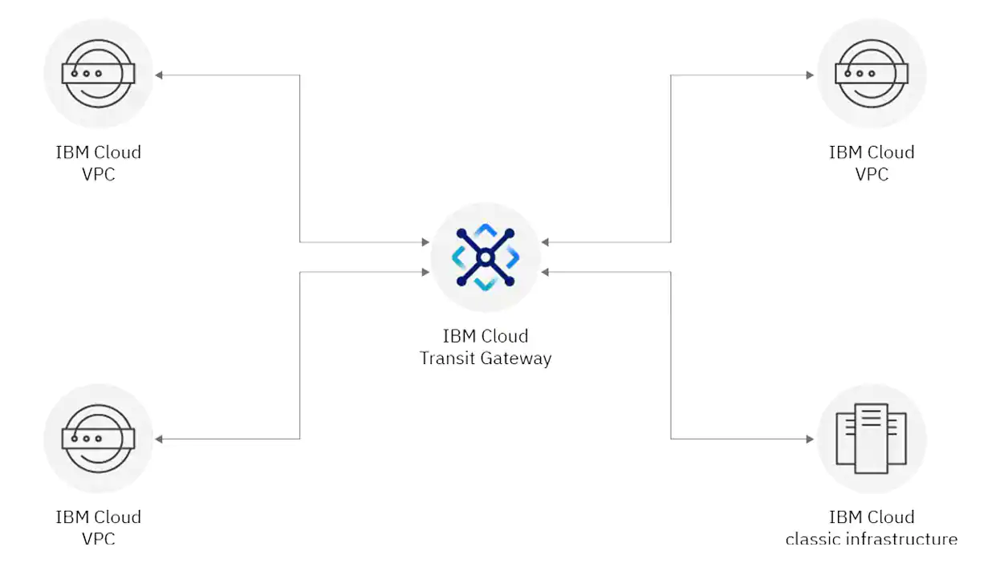

# IBM Cloud Transit Gateway

**IBM Cloud Transit Gateway** helps you connect and manage your IBM Cloud Virtual Private Cloud (VPC) networks.

Use Transit Gateway to manage the interconnection between these resources across multiple regions. 

With IBM Cloud Transit Gateway, you can connect:

- VPCs in the same region (local routing)
- VPCs in different regions (global routing)
- VPCs to your IBM Cloud classic infrastructure
- Networks using a Generic Routing Encapsulation (GRE) tunnel
- On-premise networks using Direct Link to your IBM Cloud networks

The following diagram shows IBM Cloud Transit Gateway connecting to IBM Cloud Virtual Private Cloud networks.

Networks can be attached to multiple local gateways and a single global gateway, enabling you to keep local traffic on a local gateway.

## Features

IBM Cloud Transit Gateway offers the following features:

### Routing

All routing options remain within the private IBM Cloud infrastructure without operating on the public internet, and are optimized for performance. IBM Cloud Transit Gateway allows customers greater flexibility, redundancy, and speed in scaling their workloads, as well as in connecting isolated networks running on IBM Cloud.

To learn how to display the routes report for a transit gateway, see [IBM Cloud Transit Gateway route reports](https://cloud.ibm.com/docs/transit-gateway?topic=transit-gateway-route-reports).

### Privacy

- Connections to and from an IBM Cloud Transit Gateway on the IBM private network are not exposed to the public internet. 
- IBM Cloud Transit Gateway is a fully redundant, fault-tolerant service with no single point of failure within [IBM Cloud Multi-Zone Regions (MZR)](https://cloud.ibm.com/docs/transit-gateway?topic=transit-gateway-tg-locations).
- IBM Cloud Transit Gateway integrates with Identity and Access Management (IAM).

### Connect across boundaries

IBM Cloud Transit Gateway interconnects your IBM Cloud VPCs with compute as well as classic resources across the globe. You can also interconnect VPCs and classic resources across IBM Cloud accounts.

### Direct Link connectivity

IBM Cloud Transit Gateway supports Direct Link connections. Connecting Direct Link to your IBM Cloud Transit Gateway on-premises network grants access to all networks connected on the transit gateway.

### Power Systems Virtaul Server connectivity

Connecting a Power Systems Virtual Server instance to your IBM Cloud Transit Gateway network grants access to all networks connected on the transit gateway. Similarly, all other connections on the transit gateway will have access to your network.

## Interconnectivity patterns

Several patterns enabled you to connect IBM Cloud VPCs and classic infrastructure to transit gateways, allowing you to build global networks of multiple VPCs and classic infrastructure resources across IBM Cloud regions to keep up with your business needs.

- [Interconnect two or more VPCs in the same MZR](https://cloud.ibm.com/docs/transit-gateway?topic=transit-gateway-about#use-case-1)
- [Interconnect two or more VPCs across multiple MZRs](https://cloud.ibm.com/docs/transit-gateway?topic=transit-gateway-about#use-case-2)
- [Interconnect one or more VPCs in the same MZR and an IBM classic network](https://cloud.ibm.com/docs/transit-gateway?topic=transit-gateway-about#use-case-3)
- [Interconnect VPCs and an IBM classic network to access all your resources across all MZRs](https://cloud.ibm.com/docs/transit-gateway?topic=transit-gateway-about#use-case-4)
- [Interconnect VPCs across accounts](https://cloud.ibm.com/docs/transit-gateway?topic=transit-gateway-about#use-case-5)
- [Connect networks to multiple local gateways](https://cloud.ibm.com/docs/transit-gateway?topic=transit-gateway-about#use-case-6)
- [Interconnect networks across accounts](https://cloud.ibm.com/docs/transit-gateway?topic=transit-gateway-about#use-case-7)
- [Connect networks using a High Availability GRE tunnel](https://cloud.ibm.com/docs/transit-gateway?topic=transit-gateway-about#use-case-8)
- [Connect on-premises network using Direct Link](https://cloud.ibm.com/docs/transit-gateway?topic=transit-gateway-about#use-case-9)
- [Location connectivity using Power Systems Virtual Server and Direct Link Connect](https://cloud.ibm.com/docs/power-iaas?topic=power-iaas-network-architecture-diagrams#network-reference-architecture-tgw)

## Tutorials

See:

- [Team based privacy using IAM, VPC, Transit Gateway and DNS](https://cloud.ibm.com/docs/transit-gateway?topic=transit-gateway-vpc-tg-dns-iam)
- [Centralize communication through a VPC Transit Hub and Spoke architecture - Part one](https://cloud.ibm.com/docs/transit-gateway?topic=transit-gateway-vpc-transit1)
- [Centralize communication through a VPC Transit Hub and Spoke architecture - Part two](https://cloud.ibm.com/docs/transit-gateway?topic=transit-gateway-vpc-transit2)

The following diagram shows an implementation of a hub and spoke architecture show in the second tutorial.

## References

- Product page [IBM Cloud Transit Gateway]https://www.ibm.com/cloud/transit-gateway)
- [Getting started with IBM Cloud Transit Gateway](https://cloud.ibm.com/docs/transit-gateway?topic=transit-gateway-getting-started)
- [About IBM Cloud Transit Gateway](https://cloud.ibm.com/docs/transit-gateway?topic=transit-gateway-about)