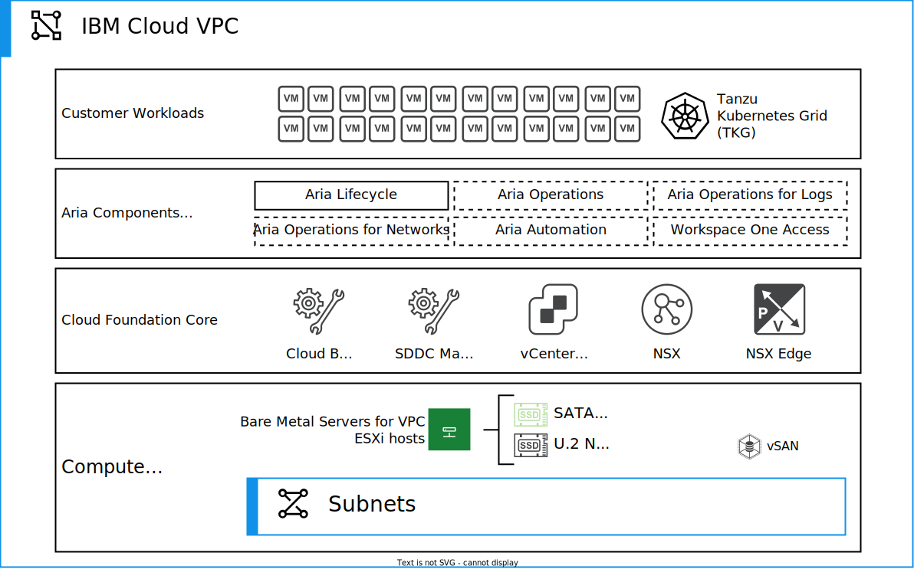

# VMware Cloud Foundation on IBM Cloud

[**IBM Cloud for VMware Cloud Foundation™**](https://cloud.ibm.com/docs/vmwaresolutions?topic=vmwaresolutions-vpc-vcf-overview) provides a ubiquitous hybrid cloud platform for both traditional enterprise apps and modern apps. IBM Cloud® Virtual Private Cloud provides the underlying infrastructure for running VMware Cloud Foundation in IBM Cloud and IBM Cloud® for VMware Cloud Foundation automation deploys the required infrastructure assets inside your own IBM Cloud® account.

[VMware Cloud Foundation](https://core.vmware.com/resource/vmware-cloud-foundation-technical-overview) is a multi-cloud platform that provides a full-stack hyperconverged infrastructure (HCI) that is made for modernizing data centers and deploying modern container-based applications. VCF is based on different components like vSphere (compute), vSAN (storage), NSX (networking), and some parts of the Aria Suite (formerly vRealize Suite). The idea of VCF follows a standardized, automated, and validated approach that simplifies the management of all the needed software-defined infrastructure resources.

This stack provides customers with consistent infrastructure and operations in a cloud operating model that can be deployed on-premises, at the edge, or in the public cloud.

## Overview

VMware Cloud Foundation deployments provide a complete set of software-defined services for compute, storage, network security, Kubernetes management, and cloud management. It includes:

- VMware vSphere® with VMware Tanzu™
- VMware vSAN™
- VMware NSX™ Data Center

and is managed though

- vCenter
- SDDC manager
- HCX
- VMware Aria® Suite (formerly known as VMware vRealize® Suite) 

The VMware Cloud Foundation management capabilities offer consistent VMware operations across private and public cloud deployments. To select an optimal IBM Cloud for VMware Cloud Foundation solution for your needs, you can select between **VMware Cloud Editions Advanced or Enterprise** that provide you access to a unique set of VMware Cloud Foundation capabilities in a bundled form.

The following diagram provides an overview of IBM Cloud for VMware Cloud Foundation.

## Benefits

The VMware Cloud Foundation architecture provides you with the fundamental building blocks for a software-defined data center. These blocks include VMware vSphere, vCenter Server, VMware NSX, VMware vSAN, and SDDC manager to manage your VMware Cloud Foundation deployment. The VMware Cloud Foundation automation and the VMware Cloud Builder appliance automate the deployment of the entire underlying infrastructure and VMware software-defined stack and you have the same architecture and user experience as in on-premises VMware Cloud Foundation deployments.

!!! key "Key benefits"

    - IBM Cloud VPC gives you the ability to easily and rapidly define and control a virtual network, which is logically isolated from all other tenants. The logical isolation is implemented by using virtual network functions and security that is built into the platform. You can freely select the private IP address space that is used in your VPC.
    - Provisioning the IBM Cloud bare metal server on IBM Cloud VPC takes minutes instead of hours when compared to the IBM Cloud bare metal server on IBM Cloud classic.
    - VMware workloads by running in IBM Cloud VPC can take advantage of all functions for VPC networking capabilities and other IBM Cloud interconnectivity services.

## Architecture

The architecture for IBM Cloud® for VMware Cloud Foundation is built upon IBM Cloud VPC network architecture and uses bare metal servers for IBM Cloud VPC. Through its native integration with IBM Cloud VPC networking, you can easily use other IBM Cloud® services with your VMware workloads or integrate networking with other IBM Cloud VPC, Classic, or Power infrastructure offerings.

For more information including an overview of the consolidated architecture and deployed assets, see [IBM Cloud® for VMware Cloud Foundation architecture overview](https://cloud.ibm.com/docs/vmwaresolutions?topic=vmwaresolutions-vpc-vcf-arch-overview).

## NSX deployment

For an introduction of VMware® NSX™ deployment details for VMware Cloud Foundation deployment architectures in IBM Cloud VPC, see [NSX deployment](https://cloud.ibm.com/docs/vmwaresolutions?topic=vmwaresolutions-vpc-vcf-nsx-t).

## Reference

- [VMware Cloud Foundation - A Technical Overview](https://core.vmware.com/resource/vmware-cloud-foundation-technical-overview)
- [IBM Cloud for VMware Cloud Foundation](https://cloud.ibm.com/docs/vmwaresolutions?topic=vmwaresolutions-vpc-vcf-overview)

### For IBM Partners

- [IBM Cloud for VMware Cloud Foundation sales kit](https://ibm.seismic.com/Link/Content/DChCWbqqf944HG2TRbjdqTcQ3Mm3)
- [IBM Cloud for VMware Cloud Foundation client deck](https://ibm.seismic.com/Link/Content/DCpjf6R6RW3XD8QRWDmb6chRPcFd)