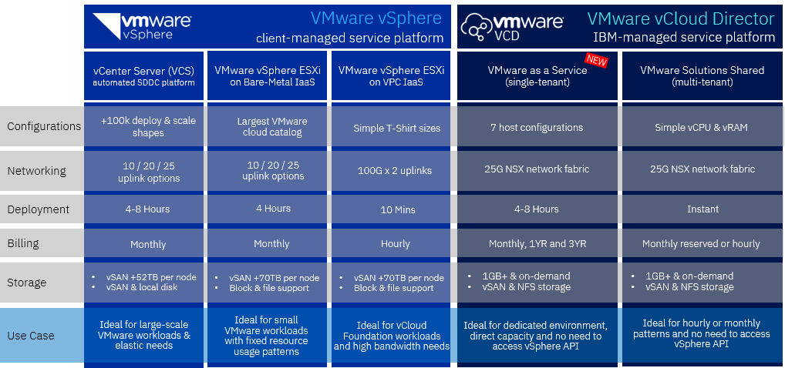

# VMware on IBM Cloud

Seamlessly migrate and modernize VMware workloads to the cloud **IBM Cloud for VMware Solutions**. Leverage your existing investments for a consistent VMware experience—retaining the same level of access, security and control. 

You can manage it yourself or having IBM manage it for you.

## Key challenges

!!! key "Challenges and solution"

    - **Extend, migrate and scale**. Easily extend your on-premises data center to address capacity expansion, on-demand app scaling, and accelerating cloud migrations of vSphere workloads to IBM Cloud—without re-architecting applications and while reducing migration complexity. See more about [deploying new or existing workloads](https://www.ibm.com/cloud/smartpapers/vmware-workloads).
    - **Cyber resiliency and recovery**. IBM Cloud’s Cyber Resiliency and Recovery solution provides a simplified business continuity plan with cost-effective disaster recovery (DR), Cloud backup, and a robust ransomware recovery solution to protect and restore your data across your IT environment. See [IBM Cloud Cyber Recovery Solutions](https://www.ibm.com/cyber-recovery).
    - **Cloud VDI (DaaS)**. Build your VDI or DaaS environment on IBM Cloud to deliver an enhanced user experience to your remote workforce and your partners, without sacrificing on security or performance. See [Desktop as a service (DaaS)](https://www.ibm.com/downloads/cas/DXJYN50L)
    - **Application modernization**. Modernize your VMware workloads with Red Hat OpenShift and Kubernetes containers. Improve business outcomes with advanced technologies such as AI and blockchain. Integrate existing VMware-based applications into a hybrid cloud strategy. See [Application modernization](https://www.ibm.com/cloud/vmware/appmod-with-containers).
    - **Data security for regulated workloads**. This offering includes a secure-by-default architecture that follows IBM's unique policy controls framework, it provides continuous compliance monitoring, and the highest level of data encryption (FIPS 140-2 Level 4). See [VMware Regulated Workloads overview](https://cloud.ibm.com/docs/vmwaresolutions?topic=vmwaresolutions-vrw-overview).

## Use case comparison

The following diagram describes the IBM offerings and their main use cases.

|  VMware vCenter Server | VMware vSphere | VMware as a Service | VMware Shared | VMware Regulated Workloads |
| - | - | - | - | - |
| Customer-managed, fully configured, and scalable VMware vCenter with NSX-T instance, built and optimized for IBM Cloud | Customizable VMware-compatible hardware for maximum flexibility | IBM-managed VMware Cloud Director instance with IBM Cloud bare metal servers, offering dedicated and scalable compute, network, and storage | IBM-managed VMware Cloud Director instance, offering virtual servers with cost-effective and flexible capacity and scalability | includes a secure-by-default architecture that follows the IBM® unique policy controls framework. It also includes continuous compliance monitoring and the highest level of data encryption FIPS 140-2 Level 4 |
| Clients who want to leverage the speed and consistency of automation for deploying environment and adding capacity while maintaining the same level of control and visibility as they enjoy on-premises. | Clients who want to start as small as a single bare metal host and design their own VMware environment that is hosted in the IBM Cloud, while maintaining the same level of control and visibility as on-premises. | <ul><li>Workloads that require consistent performance related to using dedicated infrastructure<li>Optimized host configuration for the use case (balanced, compute-intensive, storage-intensive)<li>Clients who want to manage their capacity at the host level directly<li>Clients who want to offload the burden of maintaining the VMware environment to IBM</ul> | <ul><li>Paying for what you use and need precisely to the GB of memory and vCPU<li>Starting small and scaling up as you need<li>Standby disaster recovery site<li>Cloud bursting during peak demands<li>Clients who want to offload the burden of maintaining the VMware environment and capacity management to IBM</ul> | The IBM Cloud® for VMware® Regulated Workloads architecture is an extension of the VMware vCenter Server® offering. The design extends and enhances the basic VMware vCenter Server® architecture to deliver a secure, high-performance platform. Clients are able to run both classic virtualized workloads and containerized applications with the addition of Red Hat® OpenShift®. |
| [VMware on Classic](./baremetal-vmware.md) | [VMware on Classic](./baremetal-vmware.md) or [VMware on VPC](./baremetal-vpc-vmware.md) | [VMware as a Service](./vmware-as-a-service.md) | [VMware Shared](./vmware-shared.md) | [VMware Regulated Workloads](./vmware-regulated.md) |

For more details, see [Compare offerings](https://cloud.ibm.com/vmware/compare_offerings).

### Offering summary diagram

The following diagram offers a comparison:

## Next steps

See:

- [IBM Cloud for VMware Solutions](https://ibm.github.io/SalesEnablement-VMware-L3/Shared/Introduction/) courseware.
- Try the 15-minute labs at [IBM Cloud for VMware Solutions Hands-on Lab](https://customerconnect.vmware.com/en/evalcenter?p=ibm-cloud-hol-gen-22) at VMware.

See product documentation:

### VMware vSphere

- [vCenter Server overview](https://cloud.ibm.com/docs/vmwaresolutions?topic=vmwaresolutions-vc_vcenterserveroverview)
- [VMware vSphere overview](https://cloud.ibm.com/docs/vmwaresolutions?topic=vmwaresolutions-vs_vsphereoverview)

### VMware vCloud Director solutions

- [VMware as a Service overview](https://cloud.ibm.com/docs/vmwaresolutions?topic=vmwaresolutions-vmware-aas-overview)
- [VMware Shared overview](https://cloud.ibm.com/docs/vmwaresolutions?topic=vmwaresolutions-shared_overview)

## Reference

- Product page [IBM Cloud for VMware Solutions](https://www.ibm.com/products/vmware)
- VMware [IBM Cloud for VMware Solutions](https://www.vmware.com/cloud-solutions/ibm-cloud.html)