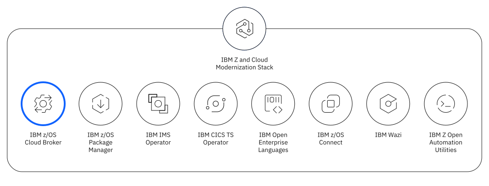

# IBM z/OS Cloud Broker

**IBM z/OS Cloud Broker** provides access to z/OS resources and services from **Red Hat® OpenShift® Container Platform**, so you can integrate your z/OS infrastructure with hybrid multi-cloud environments and strategies.

IBM z/OS Cloud Broker is packaged in the **IBM Z and Cloud Modernization Stack** which enables application owners and IT architects to jumpstart application modernization and IT automation faster, with less cost and risk. This enables simplified access to mainframe applications and data, agile enterprise DevOps, and automated IT management. 

z/OS Cloud Broker provides access to z/OS services within private cloud platforms where they can be used by the development community. It promotes a modern cloud-native experience by combining z/OS-based services and resources with your hybrid cloud environments. Developers can quickly create, modernize, deploy, and manage applications within the security of their firewall, themselves, without the need for intervention from system administrators.

## Features

z/OS Cloud Broker includes the following key features:

**Integrate z/OS resources with Red Hat OpenShift platform**.
Get the services and resources of z/OS within RedHat® OpenShift®, a Kubernetes-based private cloud platform for building and running cloud-native applications and modernizing existing enterprise applications. Create connectivity from z/OS to an industry-standard K8s container runtime with an emphasis on simplicity, robustness, and portability.

**Use z/OS resources without needing special skills**.
Focus on rapid innovation with self-service access to z/OS resources, including service catalogs with customized services that exploit the multi-tenancy and rapid elasticity of z/OS. The broker also offers integration of IBM Z with distributed and open technology and tooling, and a cloud platform designed to facilitate management and compliance for cloud-native application development.

**Get the safety/security/control of on-premises private cloud**.
The broker integrates with your on-premises private cloud platform, controlled from behind your firewall and aligning with your organization's security and regulatory processes. All z/OS services are managed and developed for consumption by the IBM Z operations teams, while you keep full control over access and levels of use with z/OS configurable cloud security.

**Leverage experience and trust in existing IT investments**.
The z/OS Cloud Broker runs on your existing infrastructure, protecting your investments in the infrastructure running within your data center as well as the skills of the professionals who support it. With z/OS Cloud Broker, you can access and deploy provisioned software services, made available through IBM Cloud Provisioning and Management for z/OS, thereby leveraging your existing investments in z/OS middleware.

## How to use Z/OS Cloud Broker

IBM® z/OS® Cloud Broker provides an operator, which is built from the Red Hat and Kubernetes Operator Framework. Operators are pieces of software that ease the operational complexity of running and maintaining applications and services in a Kubernetes cluster.

After you create an IBM z/OS Cloud Broker instance, you log in to z/OS Cloud Broker to define z/OS® endpoints and import an operator collection. 

z/OS Cloud Broker creates operators for the z/OS resources and tasks that are defined in the imported operator collection. The operators that z/OS Cloud Broker creates enable stateful management of the defined resources and tasks.

After you import an operator collection and z/OS Cloud Broker creates operators for the tasks and resources that are defined in the collection, the tasks and resources are exposed as tiles in the Developer Catalog in the Red Hat® OpenShift® Container Platform web console. Application developers can access the Developer Catalog to self-provision the resources that they need for their applications.

For the step-by-step details, see [Importing an operator collection](https://www.ibm.com/docs/en/cloud-paks/z-modernization-stack/2023.4?topic=interface-importing-operator-collection#procedure).

## References

- Product page: [IBM z/OS Cloud Broker](https://www.ibm.com/products/zos-cloud-broker)
- [Automating z/OS resources provisioning (z/OS Cloud Broker)](https://www.ibm.com/docs/en/cloud-paks/z-modernization-stack/2023.4?topic=automate-zos-resources-provisioning-zos-cloud-broker)