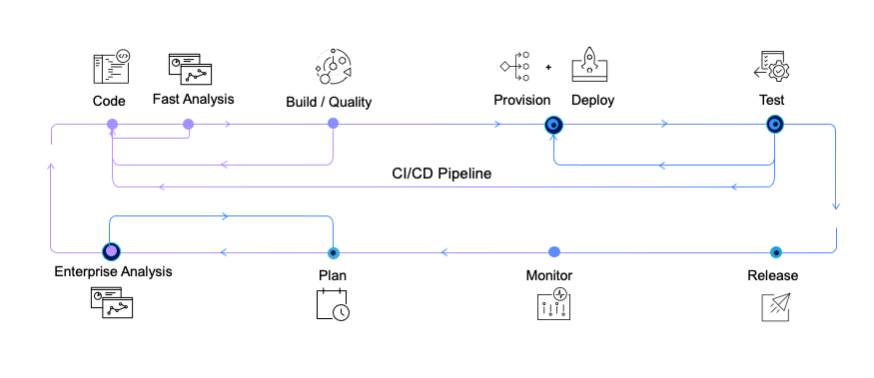
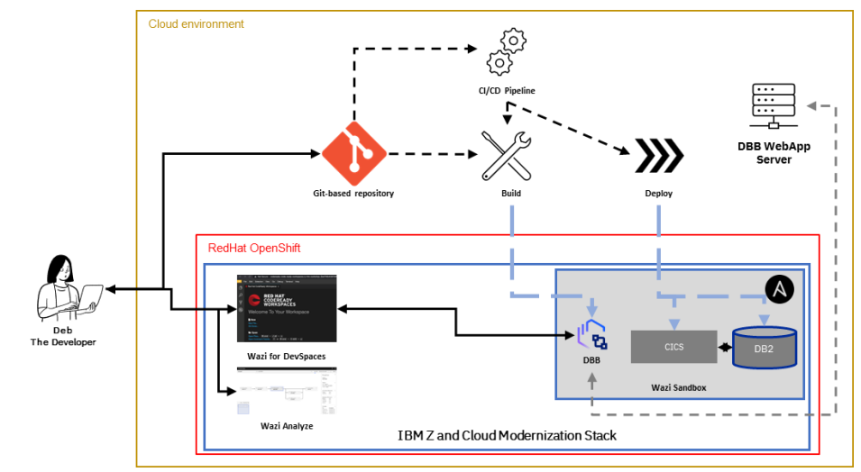

# A modern DevOps platform for mainframe applications with IBM Cloud

Deliver new business functions and changes to the existing functions at cloud scale. Enterprises are adopting secure DevOps and GitOps practices embracing Open Source tools and standard processes to help development, test and operations teams work together while modernizing the workloads.

!!! key

    The most effective organizations include IBM z/OS® applications alongside cloud-native applications, treating IBM Z as another platform that can be leveraged. This approach empowers teams to use a single pipeline to orchestrate the development, integration and deployment of an application across multiple target platforms and environments with the right security rules in place.

## DevOps business drivers

IBM zSystems becomes just another platform for an organization adopting DevOps across the enterprise. 

By incorporating common tools and processes based on open-source technologies you:

- Address key requirement for enterprises to lower the entry barrier for developers on zSystems
- Support new graduates and cloud developers to work on IBM zSystem seamlessly.
- Align mainframe development practices with cloud development processes and delivery cycles.

## DevOps technology solution

The solution integrates CI/CD pipelines spanning x86 and z/OS compute infrastructure available in IBM Cloud. Developers can build innovative solutions and test them on respective infrastructure and deliver changes faster with confidence.

Key components of the system include: 

- IBM zSystems supports the latest development, operational tools and processes and features z/OS dev and test through [IBM Wazi as a Service](https://www.ibm.com/cloud/wazi-as-a-service). 
- IBM Cloud offers a fully functional mainframe through a high-performing IBM Z compute Virtual Server Instance (VSI) in [IBM Cloud Virtual Private Cloud (VPC)](https://www.ibm.com/cloud/vpc) that can be integrated with modern DevOps toolchains with built-in security and compliance features. 
- Open Source tool chain, familiar to cloud developers.

!!! key "Key value to the business"

    - The solution helps remove skills barriers, eliminates contention between multiple teams sharing on-premises-based IBM Z LPAR and spurs innovation in mainframe application development and test processes.
    - Takes advantage of many cloud services—like data and [AI](https://www.ibm.com/cloud/learn/what-is-artificial-intelligence)—to modernize mainframe applications. 
    - Security and compliance services available in IBM Cloud can protect and validate mainframe applications and data during the development phase.

Enterprise DevOps solution architectures can be implemented on IBM Cloud to help set up an integrated DevOps pipeline suitable for both cloud-native distributed and mainframe applications. They can 

!!! value "Key value to developers"

    - Get started with a z/OS dev and test virtual server on IBM Cloud in under six minutes.
    - Enable continuous testing with an IBM zSystem in IBM Cloud that performs up to 15x faster.

    See [Mainframe Application Modernization with IBM Cloud and IBM zSystems](https://www.ibm.com/blog/mainframe-application-modernization-with-ibm-cloud-and-ibm-zsystems/) for specifics on these claims.

## Enterprise DevOps pattern

IBM zSystems® should be an integral part of the Enterprise DevOps strategy. DevOps is a way of working that drives a culture of continuous learning, continuous improvement, transparency, visibility, and trust. 

A single heterogeneous pipeline can be used to orchestrate the development, integration, and deployment of an application across multiple target platforms and environments with the right security rules in place. This single pipeline should handle all stages of the process from build tasks such as compilation and binds through to artifact packaging, deployment, and larger scale Integration testing. 

For a deep dive, see [Enterprise DevOps pattern](https://www.ibm.com/cloud/architecture/architectures/z-enterprise-devops-pattern). The article describes scenarios for:

- Continuous integration
- Continuous test
- Test Environments and Infrastructure automation

## Create the pipeline

Runs on Red Hat OpenShift. After you validate the modified code and debug it in the IDE, the CI/CD pipeline takes the committed code. Then, the CI/CD pipeline automatically builds, tests, qualifies, and deploys the code to the target z/OS system.

The following diagram shows a generic implementation of a CI/CD Cloud-based development & test 
environment for mainframe applications:

See [Creating a CI/CD pipeline for z/OS applications](https://www.ibm.com/docs/en/wdfrhcw/1.4.0?topic=creating-cicd-pipeline-zos-applications).

## DevOps for mainframe cookbook

Learn more by reading a cookbook presenting different recipes to build and configure enterprise CI/CD pipelines for developing and testing mainframe applications on Cloud platforms, by leveraging the **IBM Z & Cloud Modernization Stack** offering. 

The IBM Z & Cloud Modernization Stack includes various capabilities to modernize mainframe applications, based on the Red Hat OpenShift platform. For development and test purposes, this offering includes Wazi Code (formerly called DevSpaces), Wazi Analyze, Wazi Deploy and Wazi Sandbox. Together, these components provide mainframe developers with a Cloud-native experience with zero installation.

Download the ebook at [Building enterprise CI/CD pipelines for mainframe applications using the IBM Z & Cloud Modernization Stack](https://www.ibm.com/support/pages/node/6960229).

### Discover and plan

Work smarter and minimize risk by [discovering application and data dependencies](https://www.ibm.com/support/z-content-solutions/discovery-plan/). Leverage tools to collaborate more effectively during the development lifecycle.

See:

- Work smarter. Explore the [architectural discovery pattern](https://www.ibm.com/cloud/architecture/architectures/z-application-discovery-pattern)
- [Discover API candidates](https://www.ibm.com/products/app-discovery-and-delivery-intelligence)
- [Manage workflows](https://www.ibm.com/products/ibm-engineering-workflow-management)

### Continuous integration

Develop, incrementally and continuously integrate code, and test it in parallel.

- Get the [modern cloud development experience](https://www.ibm.com/products/z-and-cloud-modernization-stack)
- Drive [faster to market](https://www.ibm.com/cloud/wazi-as-a-service)

### Continuous testing

Detect defects early in the delivery lifecycle through automation and best practices for testing.

- [Shift-left testing](https://www.ibm.com/products/z-virtual-test-platform)
- [Provisioning environments](https://www.ibm.com/products/virtual-dev-and-test-zos) on IBM Cloud
- [Unit testing](https://www.ibm.com/products/developer-for-zos)

### Continuous delivery

Deliver audited, controlled deployments with modern tools.

- [IBM Wazi Deploy](https://www.ibm.com/docs/en/developer-for-zos/16.0?topic=deploying-zos-wazi-deploy)
- [Automated deployments](https://www.ibm.com/cloud/urbancode)
- Provision to [multi-cloud](https://www.ibm.com/support/z-content-solutions/ansible)

## DevOps next steps

See:

- For architecture, solution description, and steps to get started, see [Wazi as a Service](./wazi.md) article in _IBM Cloud for Partners_.
- [Improve business agility and provide modern DevOps platform for mainframe applications with IBM Cloud](https://www.ibm.com/downloads/cas/Y3JDDJOD)
- For the IBM product page, see [IBM Wazi as a Service](https://www.ibm.com/cloud/wazi-as-a-service).
- For product documentation, see [IBM Wazi as a Service](https://www.ibm.com/docs/en/wazi-aas/1.0.0).
- Redbooks [Mainframe Application Modernization Patterns for Hybrid Cloud](https://www.redbooks.ibm.com/abstracts/sg248532.html).
- [Enterprise DevOps pattern](https://www.ibm.com/cloud/architecture/architectures/z-enterprise-devops-pattern).
- MIT Technology Review Insights [A catalyst for transformation](https://www.ibm.com/downloads/cas/BLLBBLGO)
- Ebook [Enterprise bug busting](https://www.ibm.com/downloads/cas/AX4OVQLV)

## References

- [Mainframe Application Modernization with IBM Cloud and IBM zSystems](https://www.ibm.com/blog/mainframe-application-modernization-with-ibm-cloud-and-ibm-zsystems/)
- [Creating a CI/CD pipeline for z/OS applications](https://www.ibm.com/docs/en/wdfrhcw/1.4.0?topic=creating-cicd-pipeline-zos-applications)
- Redbooks [Mainframe Application Modernization Patterns for Hybrid Cloud](https://www.redbooks.ibm.com/abstracts/sg248532.html)
- [Building enterprise CI/CD pipelines for mainframe applications using the IBM Z & Cloud Modernization Stack](https://www.ibm.com/support/pages/node/6960229)
- [Enterprise DevOps pattern](https://www.ibm.com/cloud/architecture/architectures/z-enterprise-devops-pattern)
- Product page [DevOps for IBM Z](https://www.ibm.com/z/devops)
- [z/OS Containers - Understanding z/OS Automation](https://community.ibm.com/community/user/ibmz-and-linuxone/blogs/juergen-holtz1/2022/04/07/zos-containers-understanding-zos-automation)