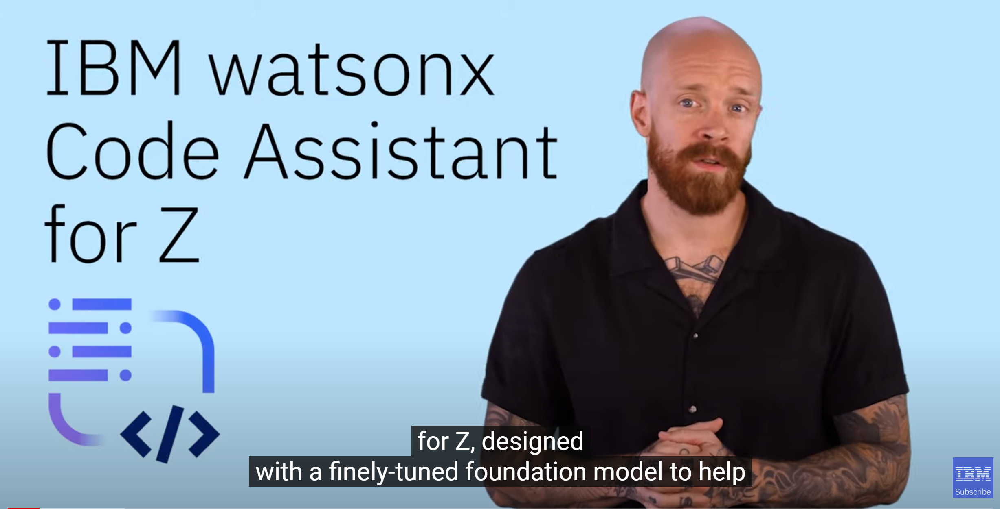

# Generative AI Capabilities

IBM is designing this product to refactor, transform, and validate COBOL code to help speed time-to-value and augment skills for critical application modernization on IBM Z.

!!! quote

    64% of executives say they need to modernize apps to use generative AI. And at the same time, generative AI has the power to transform app modernization. Two sides of the same coin.

## What an exec needs to know about Generative AI

The IBM Institute for Business Value has identified three things every leader needs to know:

1. [Combined, generative AI and app modernization fuel a virtuous cycle of increased agility and revenue growth](https://www.ibm.com/thought-leadership/institute-business-value/en-us/report/ceo-generative-ai/application-modernization)
2. [Generative AI presents an opportunity for businesses to retire their technical debt once and for all](https://www.ibm.com/thought-leadership/institute-business-value/en-us/report/ceo-generative-ai/application-modernization)
3. [Generative AI is closing the gap between IT and the business—finally](https://www.ibm.com/thought-leadership/institute-business-value/en-us/report/ceo-generative-ai/application-modernization)

Business leaders expect generative AI to break down traditional barriers to app modernization. More than half of executives cite financial or technical challenges as hurdles to delivering strategic outcomes with modernization projects. 

## What you need to do

1. [Grab low-hanging fruit by applying generative AI to apps that have already been modernized](https://www.ibm.com/thought-leadership/institute-business-value/en-us/report/ceo-generative-ai/application-modernization)
2. [Go after opportunities that were previously “off limits”—such as applications and processes in core systems](https://www.ibm.com/thought-leadership/institute-business-value/en-us/report/ceo-generative-ai/application-modernization)
3. [Stop measuring business and IT goals separately—explicitly prioritize IT projects with the strongest links to business value](https://www.ibm.com/thought-leadership/institute-business-value/en-us/report/ceo-generative-ai/application-modernization)

## Generative AI and automated tooling

Leverage tailor-made foundation models to populate AI-code recommendations to accelerate your business.

**IBM watsonx Code Assistant** is a solution that leverages generative AI to accelerate code generation and increase developer productivity. Purpose-built for targeted use cases, watsonx Code Assistant uses AI to support Application Modernization and IT Automation.

The product will be enabled by a 20 billion parameter large language model (LLM) for code.

See [watsonx Code Assistant](https://www.ibm.com/products/watsonx-code-assistant).

**watsonx Code Assistant for Z** is a new generative AI-assisted product that will help enable faster translation of COBOL to Java on IBM Z and enhances developer productivity on the platform. 

### watsonx Code Assistant use cases

- [Red Hat Ansible Lightspeed](https://www.redhat.com/en/engage/ansible-lightspeed). IBM watsonx Code Assistant for Red Hat Ansible Lightspeed enables developers of all skill levels to write Ansible playbooks with AI-generated recommendations. Purpose-built to accelerate IT Automation, the service will deliver automation content recommendations that are written in YAML code, and adhere to accepted best practices, for an enhanced Ansible experience users can be confident in.
- [IBM Z Application Modernization](https://community.ibm.com/community/user/ibmz-and-linuxone/blogs/kyle-charlet/2023/08/22/harnessing-generative-ai-for-modernization). IBM watsonx Code Assistant for Z is an end-to-end AI-assisted mainframe application modernization solution that will make it easier for developers to incrementally modernize COBOL business services and selectively convert to high-quality Java code. With watsonx Code Assistant for Z, clients will be able to leverage generative AI and automated tooling to accelerate their mainframe application modernization journey –while addressing key challenges around developer skills and time to value.

## Code model

These solutions are powered by [IBM's watsonx.ai code model](https://www.ibm.com/products/watsonx-ai?_gl=1*o2ibgs*_ga*MjcxNzQwMjkzLjE2OTUzOTg4MjM.*_ga_FYECCCS21D*MTY5NTY1MjU0Mi40LjEuMTY5NTY1NDAwNS4wLjAuMA..), which will have knowledge of 115 coding languages1 having learned from 1.5 trillion tokens.2 At 20 billion parameters, it is on target to become one of the largest generative AI foundation models for code automation.3 

The watsonx Code Assistant product portfolio will extend over time to address other programming languages, to improve time to value for modernization and address growing skills challenges for developers.

## References

- [The CEO's guide to Generative AI: Application modernization](https://www.ibm.com/thought-leadership/institute-business-value/en-us/report/ceo-generative-ai/application-modernization)
- [IBM Unveils watsonx Generative AI Capabilities to Accelerate Mainframe Application Modernization](https://newsroom.ibm.com/2023-08-22-IBM-Unveils-watsonx-Generative-AI-Capabilities-to-Accelerate-Mainframe-Application-Modernization)
- Product page [IBM watsonx Code Assistant](https://www.ibm.com/products/watsonx-code-assistant)