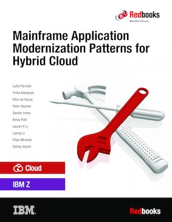

# Modern mainframe developer enablement roadmap

This article describes the steps you can take to learn how to get started learning to code on the mainframe.

- [Hands-on mainframe coding](#hands-on-mainframe-coding)
- [Learning Wazi concepts](#learn-wazi-concepts)
- [Learn DevOps](#learn-devops-as-a-service)
- [Mainframe development pattern](#ibm-redbooks-mainframe-application-modernization-patterns-for-hybrid-cloud)

## Hands-on mainframe coding

**IBM Z Xplore learning platform** is a challenge-based learning platform available globally at no cost, with no prior knowledge required! You get hands-on experience to learn in-demand IBM Z® skills to help build a career in enterprise computing which powers 68% of all worldwide transactions. Earn digital badges that qualify you to participate in IBM Z Virtual Career Fairs and showcase your skills to employers. 

You will learn: 

- **Fundamentals and concepts:** Learn about data sets and coding languages such as JCL, Python, and USS using the VS Code modern application. Get introduced to IBM Z security, enterprise scalability and more.
- **Advanced:** Get hands-on learning around REXX, COBOL, Linux®, VSAM, REGEX, JCL, Python, Db2® and more.
- **Extended:** Expand your skills with hands-on learning around TSO/ISPF, Node.js, machine learning, Ansible® and more.

The following illustration maps out the fundamental journey.

You’ll be communicating directly with a Logical Partition (LPAR) on one of the z15 machines. In other words, you get a piece of a z15 all to yourself. We want you to be able to learn as much as you want to on this platform, and you deserve to play on a real system.

You will use VS Code, an extensible editor made by Microsoft, to communicate with the mainframe. However, you can use APIs, custom apps, and terminals as another option as well. The software is available for Mac, Windows, and Linux. 

See [Visual Studio Code](https://code.visualstudio.com/docs/supporting/requirements) for your development system requirements.

### Get started

Sign up for [IBM Z Xplore](https://ibmzxplore.influitive.com/channels/1) and begin your journey.

### Badge

[IBM Z Xplore – Concepts](https://www.ibm.com/downloads/cas/lxgl0gd8) badge demonstrates that you have learned and displayed fundamental mainframe skills. This individual is able to perform everyday tasks in an IBM zSystems mainframe environment, including administering data sets, formulating commands, managing JCL, scripting actions in USS (UNIX® System Services), writing and debugging Python, and orchestrating actions through IBM zSystems Open Automation Utilities.

## Learn Wazi concepts

Next, learn the concepts of Wazi development.

[IBM Wazi Developer Fundamentals](https://yourlearning.ibm.com/credential/CREDLY-bf46e58b-5c2d-4112-8a90-cd6f2924bbee) badge earner has a good understanding of the capabilities, benefits and usage of Wazi Developer. This includes capabilities and benefits for Wazi Developers, how to use Wazi Developer, and how it supports J2C.

Upon completion of this course, you will be familiar with the following topics:

- Module 1 – Why Wazi Developer
- Module 2 – What is Wazi Developer
- Module 3 – How does it work
- Module 4 – Wazi Sandbox: Managing development and test environments
- Module 5 – Wazi Code: Developing applications with your choice of IDE
- Module 6 – Wazi Analyze: Understand the impact of changes with IBM Wazi
- Module 7 – Create a CI/CD pipeline for a z/OS application
- Module 8 – zTrial and Badge Quiz

## Learn DevOps as a Service

Learn about [Cloud Native Z DevOps as a Service](https://mediacenter.ibm.com/playlist/details/1_5q5qeehb/) in a series of step-by-step videos.

Each video in this series is shorter than ten minutes. Learn:

1. [IBM Wazi as a Service Overview](https://mediacenter.ibm.com/media/IBM%20Wazi%20as%20a%20Service%20Overview/1_xpoxgjsa)
2. [Managing an IBM Cloud Account](https://mediacenter.ibm.com/media/IBM%20Wazi%20as%20a%20Service%3B%20Managing%20an%20IBM%20Cloud%20Account/1_9agz7ap1)
3. [Creating a z/OS Virtual Server Instance](https://mediacenter.ibm.com/media/IBM%20Wazi%20as%20a%20Service%3B%20Creating%20a%20z_OS%20Virtual%20Server%20Instance/1_b8aircfl)
4. [Connecting a Virtual Server Instance (VSI)](https://mediacenter.ibm.com/media/IBM%20Wazi%20as%20a%20Service%3B%20Connecting%20a%20Virtual%20Server%20Instance%20(VSI)/1_vy4gl2nc)
5. [Azure DevOps for Mainframe Development with Wazi aaS](https://mediacenter.ibm.com/media/Azure%20DevOps%20for%20Mainframe%20Development%20with%20Wazi%20aaS/1_w7b5xzzy)
6. [Create a toolchain to secure z/OS application development in IBM Cloud](https://mediacenter.ibm.com/media/Create%20a%20toolchain%20to%20secure%20z_OS%20application%20development%20in%20IBM%20Cloud/1_ax4aw1hr)
7. [Running COBOL DBB Build Sessions with your VSI using IBM Wazi and VS Code](https://mediacenter.ibm.com/media/IBM%20Wazi%3B%20Running%20COBOL%20DBB%20Build%20Sessions%20with%20your%20VSI%20using%20IBM%20Wazi%20and%20VS%20Code/1_jnw8r2vp)
8. [Running a Debug Session with a Virtual Server Instance](https://mediacenter.ibm.com/media/IBM%20Wazi%20as%20a%20Service%3B%20Running%20a%20Debug%20Session%20with%20a%20Virtual%20Server%20Instance/1_5pfnbk24)
9. [Deploying and using Wazi Developer for Workspaces from an OpenShift Cluster in IBM Cloud](https://mediacenter.ibm.com/media/Wazi%20aaS%3B%20Deploying%20and%20using%20Wazi%20Developer%20for%20Workspaces%20from%20an%20OpenShift%20Cluster%20in%20IBM%20Cloud/1_ijmezvwu)
10. [Creating an Image](https://mediacenter.ibm.com/media/IBM%20Wazi%20as%20a%20Service%3B%20Creating%20an%20Image/1_7nwpwxxk)
11. [Creating a Component](https://mediacenter.ibm.com/media/IBM%20Wazi%20as%20a%20Service%3B%20Creating%20a%20%20Component/1_nipm2iwj)
12. [Creating a Source Environment](https://mediacenter.ibm.com/media/IBM%20Wazi%20as%20a%20Service%3B%20Creating%20a%20Source%20Environment/1_dp3ph9m0)
13. [Creating a Target Environment](https://mediacenter.ibm.com/media/IBM%20Wazi%20as%20a%20Service%3B%20Creating%20a%20Target%20Environment/1_jg1dyaif)
14. [Quickly creating a toolchain for z/OS with a CI pipeline](https://mediacenter.ibm.com/media/Quickly%20creating%20a%20toolchain%20for%20z_OS%20with%20a%20CI%20pipeline/1_5ev8jm2q)

## IBM Redbooks: Mainframe Application Modernization Patterns for Hybrid Cloud

IBM Z integrated into a hybrid cloud based on Red Hat OpenShift provides resiliency and secure architecture that allows for application workload placement on the "best fit" infrastructure to maximize scale, performance, and efficiency. You can accelerate application modernization today by using architectural patterns that are building blocks and best practices to learn how to implement and deploy application modernization in an IBM Z environment integrated with public cloud.

In the IBM Redpaper Accelerate Mainframe Application Modernization with Hybrid Cloud, REDP-5705, we discussed strategies and architectural solutions that can accelerate your mainframe application modernization by leveraging hybrid cloud environments.

This IBM Redpaper publication takes that IBM Redpaper on a deeper dive as it discusses and demonstrates implementation approaches to modernization when adopting a hybrid cloud with IBM Z. We discuss and demonstrate application centric, data integration/access centric, and event driven modernization patterns.

Additionally, we provide a chapter on modernizing an enterprise's DevOps with patterns and a chapter on managing your applications.

Finally, we conclude with a demonstration of deployments of production applications.

This IBM Redbooks® publication provides information for IT Architects, IT Specialists and system administrators.

[Hybrid Cloud with IBM Z Redbook](https://www.redbooks.ibm.com/abstracts/sg248532.html)

- Chapter 1. Introduction
- Chapter 2. Modernized application architectures
- Chapter 3. Modernized data access architectures
- Chapter 4. Event-driven architecture with IBM z/OS
- Chapter 5. Modernizing Enterprise DevOps
- Chapter 6. Managing your applications
- Chapter 7. Deploying production applications
- Appendix A. Voting app changes to support an IBM Db2 database
- Appendix B. Additional material

## Reference

- [IBM Z Xplore learning platform](https://www.ibm.com/z/resources/zxplore)
- [Hybrid Cloud with IBM Z Redbook](https://www.redbooks.ibm.com/abstracts/sg248532.html)