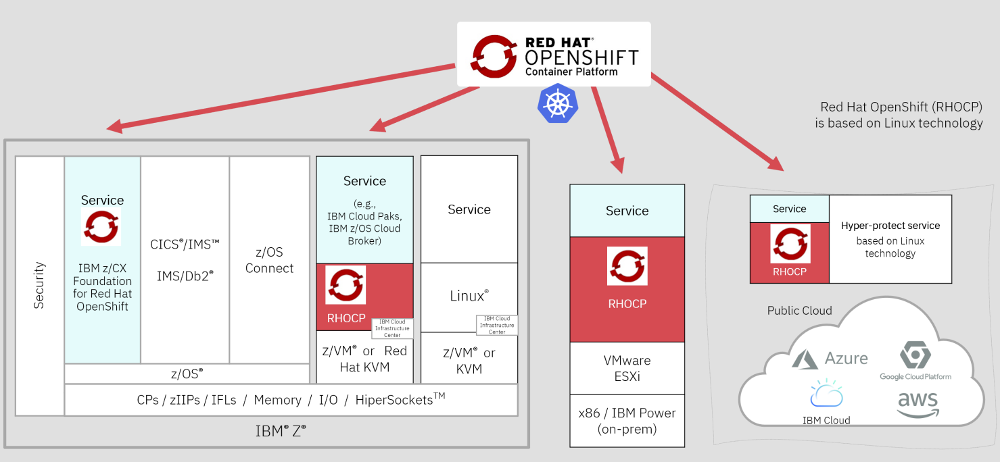
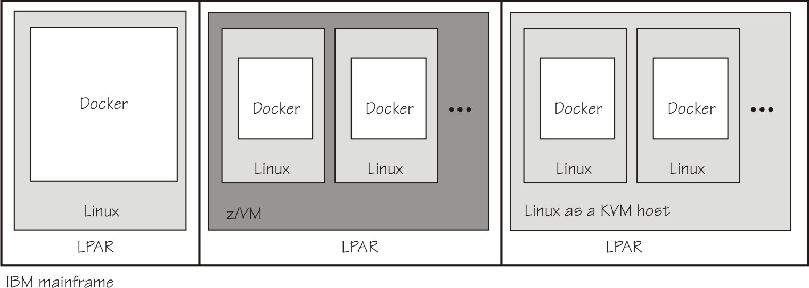
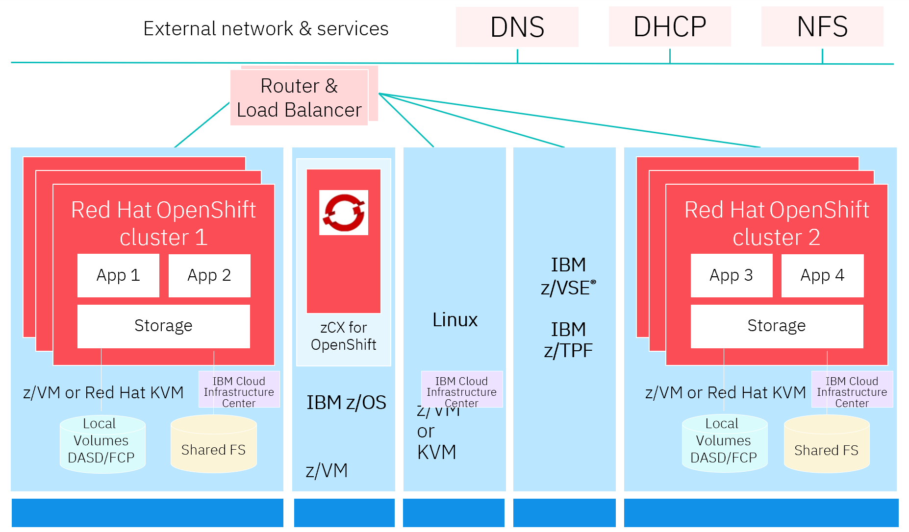
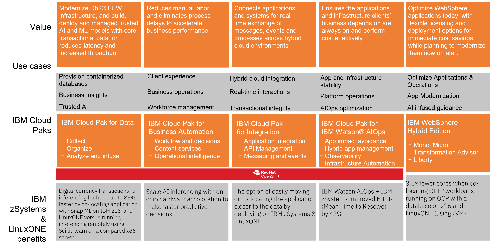
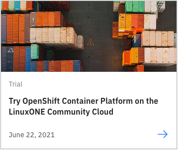
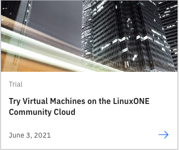

# LinuxONE

IBM LinuxONE is an enterprise-grade Linux® server that brings together IBM’s experience in building enterprie systems with the openness of the Linux operating system.

!!! key "Use cases"

    - Sustainability
    - Secure, confidential computing
    - Scalability
    - Co-location of workloads with mainframe apps and data
    - Modern development practices
    - AI

## Why Linux on mainframe

Linux on IBM Z® provides you an impressive Linux and private cloud environment, especially for workloads that require high levels of resilience, flexibility, and security. 

!!! quote

    IBM zSystems and LinuxONE can help you reduce your total cost of ownership (TCO) by consolidating workloads and improving resource utilization. IBM zSystems and LinuxONE can also help you reduce software licensing costs. 

### Sustainability

LinuxONE is designed to help you meet your sustainability goals. Consolidating workloads from many x86 servers onto a single LinuxONE server can reduce energy costs, carbon footprint, and floor space.

Learn how a single IBM LinuxONE Emperor 4 delivers scalability, doing the work of up to 2000 x86 cores.[^1]

Consolidating Linux workloads on 5 IBM LinuxONE Emperor 4 systems instead of running them on compared x86 servers under similar conditions can reduce energy consumption by 75%, space by 50%, and the CO2e footprint by over 850 metric tons annually.[^2]

See [Sustainability on IBM LinuxONE 4](https://www.ibm.com/products/linuxone-4/sustainability).

With a unique architecture designed to meet the needs of mission-critical workloads, LinuxONE provides a sustainable, secure and scalable system for companies of all sizes. 

IBM® LinuxONE is a platform for the Linux® operating system built on a secure, reliable, scalable and [sustainable](https://www.ibm.com/products/linuxone-4/sustainability) architecture. It is used in many different industries worldwide.

### Security

Security is architected into LinuxONE. Pervasive encryption is designed to encrypt all data associated with an application, database, or cloud service — whether at rest or in transit.

!!! quote

    “A key word we associate with IBM, and with IBM Z solutions in particular, is trust. The sophisticated encryption enabled by IBM technology puts our—and our customers’—minds at rest, knowing that their data is well protected.”

This level of security is delivered with little overhead by the on-chip **Central Processor Assist for Cryptographic Function (CPACF)** and the dedicated Crypto Express adapter. The availability of this level of encryption at scale can make it easier for organizations to meet compliance mandates for regulations.

Security is further promoted by protecting cryptographic keys by using a **Hardware Security Module (HSM)**.

**IBM Hyper Protect Virtual Servers** adds further security capabilities at a logical partition level. Hyper Protect Virtual Servers provides workload isolation, restricted administrator access, and tamper protection against internal threats, including from systems administrators.

**Secure Execution for LinuxONE** is a hardware-based approach to security that’s intended to protect sensitive data in use. To achieve this objective, it isolates individual on-premises and cloud workloads from both internal and external attacks. Secure Execution uses a hardware-based Trusted Execution Environment that isolates workloads in order to restrict access to data. It can process unencrypted memory securely without exposing the data to the hosted or other external environments. Secure Execution also provides isolation between KVM hypervisor hosts and guests in the VMs.

**Data Privacy Passports** is designed to support encryption everywhere through a secure service container appliance. To achieve this objective, an organization’s security policy can remain active and operate on eligible data regardless of where the data resides in the enterprise. 

### Scalability

One key difference between IBM LinuxONE and other Linux systems is that LinuxONE’s hardware is engineered to offer 
dramatic improvements in performance, security, and reliability. In particular, LinuxONE can scale up to handle large databases when compared to other approaches. The platform also enables the consolidation of multiple database servers onto a single system. These hardware advantages create the opportunity to run databases on a single scale-up LinuxONE machine rather than multiple scale-out servers. Transitioning from a scale-out to a scale-up strategy helps rganizations increase performance, achieve higher utilization, and reduce costs.

### Higher utilization

Because LinuxONE servers have higher processing, storage, and Input/Output (I/O) capacities than x86 servers, a LinuxONE server will generally support many more active applications than an x86 server. However, that’s not the whole story. LinuxONE and x86 machines support fundamentally different levels of CPU utilization.

### Modern development practices

Linux and open source: Open source and the Linux operating system drive innovation and efficiency for your 
organization. The LinuxONE platform supports the three most common Linux distributions.

Key capabilities that have been validated for LinuxONE include the following:

- Languages: Python, Pearl, COBOL, Java, Node.js
- Management: IBM Cloud Manager, IBM Cloud Paks, Red Hat OpenShift Container Platform
- Database: Oracle, MariaDB, MongoDB, PostgreSQL, EDB
- Analytics Tools with Hadoop, Big Insights, DB2BLU and Spark

Use DevSecOps practices to deploy your applications.

The following diagram shows and example how hybrid workloads and multiple Red Hat OpenShift clusters can run in parallel on a physical IBM Z server. Adapt enterprise DevOps with consistent, cloud native development, and CI/CD tooling.

IBM Partners can access a deep dive presentation, [Red Hat OpenShift with IBM Z and LinuxONE](https://ibm.seismic.com/Link/Content/DC9gFmFP4GmDj822Q64Fd7JbpXMV).

### Linux containers on Z

Containers, an increasingly popular technology for deploying and running software on Linux, can run on IBM LinuxONE™ and IBM Z®.

With containers, you can run multiple encapsulated workloads on a single Linux instance. Docker is a leading software container platform. Docker uses copy-on-write and overlay file system technology, to efficiently deploy and run workloads in containers. For isolation it uses Linux resource scoping mechanisms.

On an IBM® mainframe, Linux instances with Docker containers can run in LPAR mode or as a guest of z/VM® or KVM. The Docker CLI and REST API are identical across hardware systems, including the mainframe.

The following diagram shows configurations for containers on mainframe.

For a deeper dive, see:

- [Linux Containers](https://www.ibm.com/it-infrastructure/linuxone/capabilities/linux-containers)
- [Docker basics on Z](https://www.ibm.com/docs/en/linux-on-systems?topic=linuxonibm/com.ibm.linux.z.ldvd/ldvd_c_docker.htm)

### Co-location pattern

You can co-locate workloads on IBM Z &dash; meaning Linux workloads run side-by-side with IBM z/OS®, IBM z/VSE®, IBM z/TPF, or container workloads, such as applications on the Red Hat® OpenShift Container Platform.

Co-located workloads benefit from great performance and operational efficiency, and leverages your investments in existing assets. Linux on IBM Z also benefits from the strengths and capabilities of outstanding IBM Z technology, such as unparalleled resiliency, encryption everywhere, high utilization and extreme scalability.

LinuxONE is available in single frame, multi frame and rack mount servers. LinuxONE 4 servers can have up to 200 cores running at 5.2 GHz and up to 40 TB of memory.

Run a variety of Linux distributions as z/VM virtual machines -- including Red Hat™ Enterprise Linux, SUSE Linux Enterprise Server, and Canonical Ubuntu Linux -- with a common experience.

The following diagram demonstrates:

- Co-locate applications and data on IBM Z/IBM® LinuxONE in a Red Hat OpenShift container that can access existing data or applications with reduced (order of magnitude lower) latency to meet SLA objectives  
- Centralized management of workloads
- Certified workload isolation and protection
- High levels of scalability with granular sharing
- Streamlined infrastructure with fewer points of attack

The co-location approach is the same for applications and data running on z/OS and Linux.

Together, application-centric patterns provide many options for addressing the scope of application modernization required while maintaining deployment flexibility, optimizing cost, and lowering risk.

Existing applications and data can be exposed via APIs. Extending or enhancing an existing application involves implementing a new containerized service, based on Red Hat OpenShift with a high-speed connection to the data, and then consuming that new service from the original application. 

For more information, see [Collocate applications pattern](https://www.ibm.com/cloud/architecture/architectures/z-collocate-applications-pattern/).

### AI

[AI Toolkit for IBM Z® and LinuxONE](https://www.ibm.com/products/ai-toolkit-for-z-and-linuxone) is a family of popular open-source AI frameworks with IBM Elite Support and adapted for IBM Z and LinuxONE hardware.

While open-source software has made AI more accessible, affordable and innovative, you need the right level of support to successfully implement these frameworks. With the introduction of an AI Toolkit for IBM Z and LinuxONE, you can leverage our proven support offering to deploy and accelerate the adoption of popular open-source AI frameworks on your z/OS® and LinuxONE platforms.

See the video [Linux on IBM zSystems and LinuxONE: Introducing AI on Linux with the IBM Integrated Accelerator for AI](https://mediacenter.ibm.com/media/Linux+on+IBM+zSystems+and+LinuxONEA+Introducing+AI+on+Linux+with+the+IBM+Integrated+Accelerator+for+AI/1_kehe9d68).

!!! key "Some AI use cases"

    Explore use cases and some relevant capabilities in the area of fraud prevention.

    - Fraud detection
    - Claims fraud prevention
    - Anti-money laundering 
    - Organized retail crime pattern recognition

    Explore use cases and some relevant capabilities in the area of business process optimization.

    - Clearning and settlement
    - Enhanced loan approval
    - Loan risk detection and mitigation
    - Proactive insurance rates
    - Insurance approval based on weather

    Explore use cases and some relevant capabilities in the area of image and text analysis.

    - Geospatial analysis
    - Natural language processing
    - Medical imaging

    Explore use cases and some relevant capabilities in the area of intelligent infrastructure.

See [Journey to AI on IBM Z and LinuxONE](https://www.ibm.com/support/z-content-solutions/journey-to-ai-on-z/).

### Cloud Paks 

**Cloud Pak for Integration** unlocks business data silos and assets as APIs, connects cloud and on-premise applications, and protects in-flight data integrity with enterprise messaging. The platform also delivers real-time event interactions, transfers data across any cloud, deploys and scales with cloud-native architecture, and shared foundational services — all with end-to-end enterprise-grade security and encryption.

When **Cloud Pak for Data** is installed on the IBM Z and IBM LinuxONE platforms, Watson Studio and Watson Machine Learning users can create, train, and deploy machine learning models. See [Cloud Pak for Data Capabilities on Linux on IBM Z and IBM LinuxONE](https://www.ibm.com/docs/en/cloud-paks/cp-data/4.7.x?topic=projects-capabilities-linux-z-linuxone).

The following table summarizes the value, use cases, and IBM Cloud Paks for zSystems and LinuxONE.

## LinuxONE 4

[IBM LinuxONE 4](https://www.ibm.com/products/linuxone-4) is the latest iteration of IBM LinuxONE enterprise servers with on-chip AI inferencing and industry-first quantum-safe technologies. 

IBM LinuxONE 4 helps organizations that care about achieving sustainability goals reduce energy costs and carbon footprint with a security-rich, high-performance server platform for data-intensive workloads.

!!! keys "Features"

    - [Simplified compliance](https://www.ibm.com/products/z-security-and-compliance-center).
    - [Confidential computing](https://www.ibm.com/downloads/cas/O158MBWG)
    - [Quantum-safe cryptography](https://research.ibm.com/blog/nist-quantum-safe-protocols)
    - [Open hubrid cloud](https://www.ibm.com/downloads/cas/A2LMYLGN)
    - [Secure critical workloads](https://www.ibm.com/products/hyper-protect-virtual-servers)
    - 99.999999% Availability
    - Engergy efficiency

## LinuxONE for VPC on IBM Cloud

LinuxONE for VPC are virtual servers based on the LinuxONE processor architecture that bring the advantages of the platform together with the advantages of VPC. For the first time, LinuxONE is available as a choice in the public cloud. This grants additional and unique options for companies and individuals looking to develop in the public cloud with the backing of an enterprise-grade Linux server. 

For those who have or are interested in similar deployments on-premises, this option allows development and testing of the application or workload in the public cloud. Spin up a few instances to experience the LinuxONE platform for just a few hours or stand up a permanent public cloud development environment before porting workloads to production on-premises. Besides the Virtual Private Cloud, these virtual servers come with a host of benefits, such as the following:

- Simplified logging and monitoring: Use a dashboard to view the health of virtual servers and their usage in a graphical interface.
- Backup and restore: Use in combination with [IBM Cloud Object Storage](https://www.ibm.com/cloud/object-storage) to ensure high availability.
- File share: Share data volumes between instances for faster communication.
- Snapshot: Take moment-in-time backups of instances and save in storage for quick recovery.
- Start/Stop/Restart: Invoke a restart without submitting a ticket and waiting for help.
- Terraform integration: Efficiently scale-up cloud infrastructure with an industry-standard tool
- Network features: Enable customers to build a secure private network for protected communication between all of their environments

The following illustrates how you can select LinuxONE virtual server instance from the IBM Cloud catalog.

​

## Get started

Provisioning, deployment and management all occur through the standard [IBM Cloud Virtual Servers for VPC catalog page](https://cloud.ibm.com/vpc-ext/provision/vs). Check out the [VPC documentation](https://cloud.ibm.com/docs/vpc?topic=vpc-getting-started) for additional help.

### Developer resources

See [Developer resources for building your open source app for Linux on IBM Z and LinuxONE](https://developer.ibm.com/blogs/developer-resources-for-building-your-open-source-app-for-linux-on-ibm-z-and-linuxone/) for information about:

- LinuxONE Community Cloud
- Oregon State University Open Source Lab IBM Z Continuous Integration
- openSUSE Build Service
- Launchpad Personal Package Archives
- Travis CI build service for IBM Z
- CircleCI’s self-hosted runner
- Open Mainframe Project
- Programming languages

To find out how your enterprise can benefit from this private, secure, and resilient hybrid multicloud environment, see [IBM zSystems fundamentals: An introductory Q&A](https://developer.ibm.com/articles/what-is-ibm-z/).

[Opportunities galore for IBM Z developers](https://developer.ibm.com/blogs/opportunities-galore-for-ibm-z-developers)

### Try out LinuxONE

 

### Use containers on LinuxONE

See:

- [Containers on LinuxONE](./containers.md)
- [Bringing up Container based Workloads on LinuxONE zVSI](https://community.ibm.com/community/user/ibmz-and-linuxone/blogs/divya-k-konoor1/2023/11/20/bringing-up-container-based-workloads-on-zvsi)

### OpenShift Cookbook

[Red Hat OpenShift Container Platform on IBM Z and LinuxONE](https://www.redbooks.ibm.com/abstracts/redp5711.html) provides a basic understanding of Red Hat OpenShift Container Platform on IBM Z and LinuxONE, discusses architectural considerations for implementation as well as resource considerations, basic deployment examples and some best practices to move forwards in your own implementations. It has been written for IT architects and IT specialists.

### AI on Z Jump Start

This github page is designed to help you get jump started on leveraging AI. It features information on how to leverage the best of the open source ecosystem on IBM Z and LinuxONE, as well as pointers to community edition and freely available software that can help you quickly get started. It additionally provides example use cases, code samples, and other content to serve as a technical resource for your AI on Z journey.

See [Getting started with AI on IBM Z and LinuxONE systems](https://ibm.github.io/ai-on-z-101/) on GitHub.

### Labs

### TCO Calculator

You can get a no-charge, lightweight estimate of savings by using the [IBM LinuxONE TCO Calculator](https://www.ibm.com/it-infrastructure/resources/tools/linuxone-tco-calculator/?mhsrc=ibmsearch_a&mhq=tco%20calculator).

## Next steps

See:

- [IBM Developer LinuxONE resources hub](https://developer.ibm.com/components/ibm-linuxone/) 
- [IBM LinuxONE Redbooks](https://www.redbooks.ibm.com/domains/linuxone)
- Product documenation [Confidential computing with LinuxONE](https://cloud.ibm.com/docs/vpc?topic=vpc-about-se)
- [LinuxONE for Dummies](https://www.ibm.com/account/reg/us-en/signup?formid=urx-36404&cm_sp=ibmdev-_-developer-articles-_-ibmcom)
- [IBM Cloud Pak for Data on IBM Z Redbook](https://www.redbooks.ibm.com/abstracts/redp5695.html) for those interested in building AI and ML models by using core transactional data, which results in decreased latency and increased throughput.

For IBM Partners:

- IDC research paper [IBM's Rackmount z16 and LinuxONE 4: Hybrid Is Also About Expanding Options for all Cloud Customers](https://ibm.seismic.com/Link/Content/DCBMM2QhWm343GhPpJF9XmMdm6dP)
- [Why AI for Business with IBM Z](https://ibm.seismic.com/Link/Content/DC33PGgX39J4gG2R7c4hV2MFBjg3)

## References

- Product page [IBM LinuxONE](https://www.ibm.com/linuxone)
- [Journey to LinuxONE](https://www.ibm.com/support/z-content-solutions/journey-to-linuxone/)
- Blog post [Announcing IBM Cloud LinuxONE Virtual Servers for VPC](https://www.ibm.com/blog/announcement/announcing-ibm-linuxone-for-vpc/)
- Developer [Get started with IBM LinuxONE](https://developer.ibm.com/articles/get-started-with-ibm-linuxone/)
- [Sustainability on IBM LinuxONE 4](https://www.ibm.com/products/linuxone-4/sustainability)
- [LinuxONE for Dummies](https://www.ibm.com/account/reg/us-en/signup?formid=urx-36404&cm_sp=ibmdev-_-developer-articles-_-ibmcom)
- [Getting started with AI on IBM Z and LinuxONE systems](https://ibm.github.io/ai-on-z-101/)

[^1]:
    IBM internal tests show that when running WebSphere and DB2 workloads, IBM LinuxONE Emperor 4 requires 16 times fewer cores than the compared x86 servers. If you scale this up to a complete IT solution this means when running this workload, the IBM LinuxONE Emperor 4 Max 125 would be doing the work of about 2000 cores of the compared x86 servers.
[^2]:
    DISCLAIMER: Compared 5 IBM Machine Type 3931 Max 125 model consists of three CPC drawers containing 125 configurable cores (CPs, zIIPs, or IFLs) and two I/O drawers to support both network and external storage versus 192 x86 systems with a total of 10364 cores. IBM Machine Type 3931 power consumption was based on inputs to the IBM Machine Type 3931 IBM Power Estimation Tool for a memo configuration. x86 power consumption was based on March 2022 IDC QPI power values for 7 Cascade Lake and 5 Ice Lake server models, with 32 to 112 cores per server. All compared x86 servers were 2 or 4 socket servers. IBM Z and x86 are running 24x7x365 with production and non-production workloads. Savings assumes a Power Usage Effectiveness (PUE) ratio of 1.57 to calculate additional power for data center cooling. PUE is based on Uptime Institute 2021 Global Data Center Survey (https://uptimeinstitute.com/about-ui/press-releases/uptime-institute-11th-annual-global-data-center-survey). CO2e and other equivalencies that are based on the EPA GHG calculator (https://www.epa.gov/energy/greenhouse-gas-equivalencies-calculator) use U.S. National weighted averages. Results may vary based on client-specific usage and location.