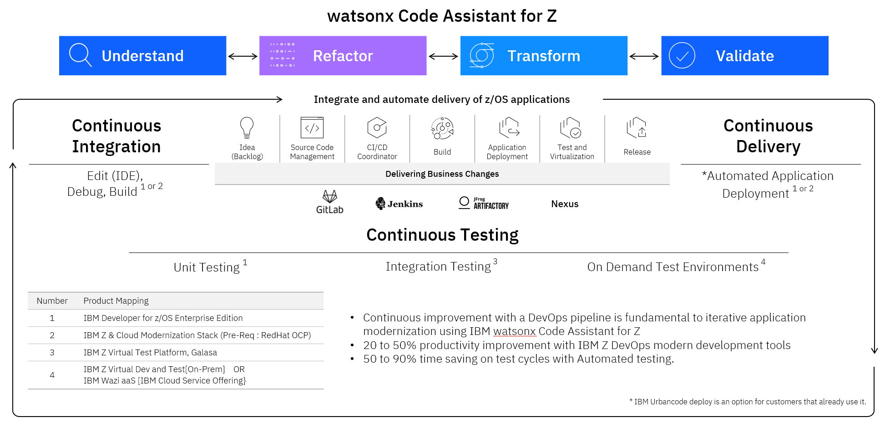
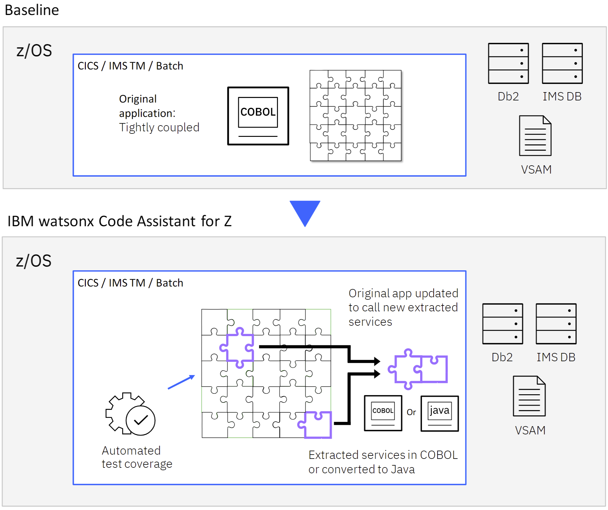

# IBM watsonx Code Assistant for Z (AI-assisted Mainframe Application Modernization)

**IBM watsonx Code Assistant for Z** provides engineers with a domain-specific generative AI-powered software development product. IBM watsonx Code Assistant is fine-tuned to enterprise-specific needs, allowing developers to generate code more quickly and accurately. This will allow organizations to accelerate application modernization efforts to improve business outcomes. At the same time, managers can expand their talent pool available to work on more initiatives across their IT organizations.

!!! important "What it does"

    IBM watsonx Code Assistant for Z is an AI-assisted mainframe application modernization solution that will make it easier for developers to incrementally modernize and refactor COBOL business services and selectively transform to high-quality Java code optimized for IBM Z. 

With watsonx Code Assistant for Z, you will be able to use generative AI and automated tooling to accelerate your mainframe application modernization journey. And using these tools, you address key challenges around developer skills and time to value:

- Helps enhance developer productivity on the platform and lead to more business agility and velocity.
- End-to-end AI assisted application modernization experience for z/OS applications
- Generative AI capabilities to enable COBOL to Java modernization, achieving high quality, easy to maintain code
- Common tools and operating models across platforms
- Accelerated code development, developer productivity and time to value with application modernization

## Overview

Watsonx Code Assistant for Z is more than just a code translator, it is a solution to support accelerated mainframe application modernization.

The steps:

1. [Understand](#understand). Begin continuous modernization of your tightly coupled applications.
2. [Refactor](#refactor). Automated tooling to identify services within an application to modernize.
3. [Transform](#transform). Leverage generative AI to accelerate COBOL to Java conversion.
4. [Validate](#validate). Automated testing capability.

!!! keys

    - De-risked approach featuring integration & interoperability while maintaining data and transactional model
    - Optimized for IBM Z qualities of service of performance, security, and scalability
    - Feature application architecture that identifies best-fit for COBOL and Java

The following diagram shows the transformation with a best-fit approach.

## Prerequisites

Prior to use watsonx Code Assistant for Z, you should:

- Read and understand IBM Redbook [Accelerate Mainframe Application Modernization with Hybrid Cloud](https://www.redbooks.ibm.com/redpapers/pdfs/redp5705.pdf)
- Have earned the [Application Modernization on IBM Z Sales Foundation Badge](https://yourlearning.ibm.com/activity/PLAN-5F912B2BB02B)

These topics provide the best practices to help clients accelerate their application modernization journey.  The curriculum looks at some of the key drivers and challenges associated with mainframe application modernization. What industry analysts are recommending, what clients are doing today, and a walk-through of IBM’s prescriptive approach to continuously modernize applications with hybrid cloud leveraging IBM technology and expertise.

## Understand

Visualize and auto-document your COBOL application at the enterprise level.

- Start of your application modernization journey with an inventory of applications, resource usage, and dependencies
- Build business alignment and confirm that your understanding of the application is valid – ensuring modernization efforts achieve expectations
- Mitigate the challenge of lack of application SMEs with automated analysis & visualized application flows to enable accelerated application understanding

IBM Application Discovery and Delivery Intelligence for IBM Z (IBM ADDI) technology is used as a part of the initial step in the IBM watsonx Code Assistant for Z lifecycle. The product documentation section [Understand](https://www.ibm.com/docs/en/watsonx-code-assistant-4z/1.0?topic=understand) provides instructions on how to use **IBM® Application Discovery for IBM Z®**, a component of ADDI, to understand and analyze your applications. 

For an overview, see [ADDI](./addi.md) in this wiki.

## Refactor

Discover programs and data needed for a refactored business service within a large application.

1. Separate code needed into a refactored service which will be easier to maintain and reuse
2. Automate the service creation process to improve accuracy and reduce time and skill required for manual developer analysis
3. Unlock modernization development agility and ease of integration

Learn about the basic knowledge of **IBM watsonx Code Assistant for Z Refactoring Assistant** and how it works in the product documentation section [Refactor](https://www.ibm.com/docs/en/watsonx-code-assistant-4z/1.0?topic=refactor).

The documentation includes tutorials:

- [Tutorial: Isolating or extracting the Update Motor Policy functionality as a service](https://www.ibm.com/docs/en/watsonx-code-assistant-4z/1.0?topic=tutorials-tutorial-isolating-extracting-update-motor-policy-functionality-as-service)
- [Tutorial: Getting a backward data flow slice](https://www.ibm.com/docs/en/watsonx-code-assistant-4z/1.0?topic=tutorials-tutorial-getting-backward-data-flow-slice)
- [Tutorial: Using a copybook as a seed in refactoring a monolithic code behind a z/OS Connect API](https://www.ibm.com/docs/en/watsonx-code-assistant-4z/1.0?topic=tutorials-tutorial-using-copybook-as-seed-in-refactoring-monolithic-code-behind-zos-connect-api)

## Transform

AI assistant to generate Java code in minutes, not months.

- Generative AI to build data structures and business logic in Java from your refactored COBOL code
- Well-architected object-oriented Java – not JOBOL
- Maintains IBM Z runtimes and qualities of services with interoperability, integration, and enterprise standardization

Transform COBOL services to Java by using an AI-assisted approach with **watsonx Code Assistant in IBM Cloud**. 

Java developers can take COBOL programs that are scanned by ADDI and use generative AI support in the Z Open Editor Visual Studio Code (VS Code) extension to convert the COBOL to Java. For the steps, see [Transforming COBOL to Java by using generative AI](https://www.ibm.com/docs/en/watsonx-code-assistant-4z/1.0?topic=transform-transforming-cobol-java-by-using-generative-ai).

## Validate

Streamlined and accelerate testing of new code.

- Automated unit test generation for both the extracted COBOL service and translated Java service
- Testing to ensure semantic equivalence of Java service
- Reduces the risk of the modernization process

## Next steps

IBM Learning course: [IBM watsonx Code Assistant for Z Technical Deep Dive](https://yourlearning.ibm.com/activity/PLAN-7AEEB533C014).

The following topics are covered in this course:

- Technical deep dive
- Pilot software request guide
- IBM watsonx Code Assistant for Z cookbook
- IBM Application Discovery and Delivery Intelligence (ADDI) cookbook
- Architecture walkthrough
- Integrated pipelines and automated testing
- COBOL/java interoperability for batch environments walkthrough
- IBM watsonx Code Assistant for Z cloud component
- Pilot scoping guide and java landing zones
- TechZone demo walkthrough

## References

- Product page [watsonx Code Assistant for Z](https://www.ibm.com/products/watsonx-code-assistant-z)
- Product documentation [IBM watsonx Code Assistant for Z](https://www.ibm.com/docs/en/watsonx-code-assistant-4z/1.0)

### For IBM partners

- [IBM watsonx Code Assistant](https://techzone.ibm.com/collection/6537cf277220880017d7ac0d) on TechZone, including:

    - Solution workshops: Technical Overview of watsonx Code Assistant for Z
    - Pilots: Pilot Scoping Guide and Landing Zone Guidance
    - watsonx Code Assistance for Z Cookbook

- [IBM watsonx Code Assistant for Z Technical Deep Dive](https://yourlearning.ibm.com/activity/PLAN-7AEEB533C014)
- [Application Modernization entry points](https://ibm.seismic.com/Link/Content/DCqPfg2PDGPhQGCC37gFbFC9bMPd)
- [WCA4Z Cookbook](https://ibm.seismic.com/Link/Content/DCCBqG4bgPWFdGCXH8Jqcj7hp9QP) and [IBM Application Discovery and Delivery Intelligence Cookbook](https://ibm.seismic.com/Link/Content/DCT7WMMVTMhWc82X7pWc6PRdmG88)
- [watsonx Code Assistant for Z Architecture Walkthrough](https://ibm.seismic.com/Link/Content/DCHR3WRXJCGH4GmQ7DTP3TgDQM88)
- TechZone collection [IBM watsonX Code Assistant for Z](https://techzone.ibm.com/collection/watsonx-code-assistant-for-z)
