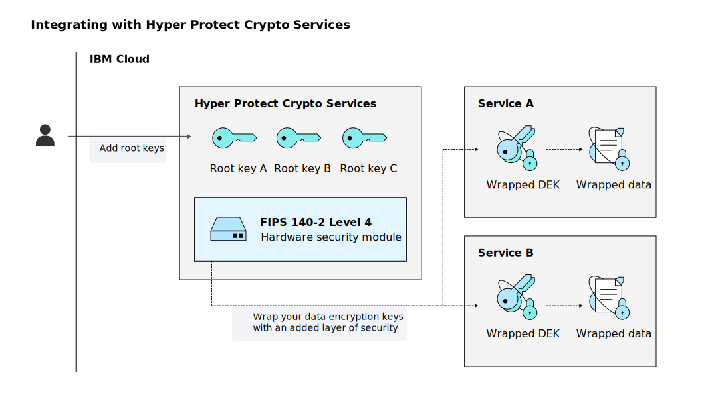
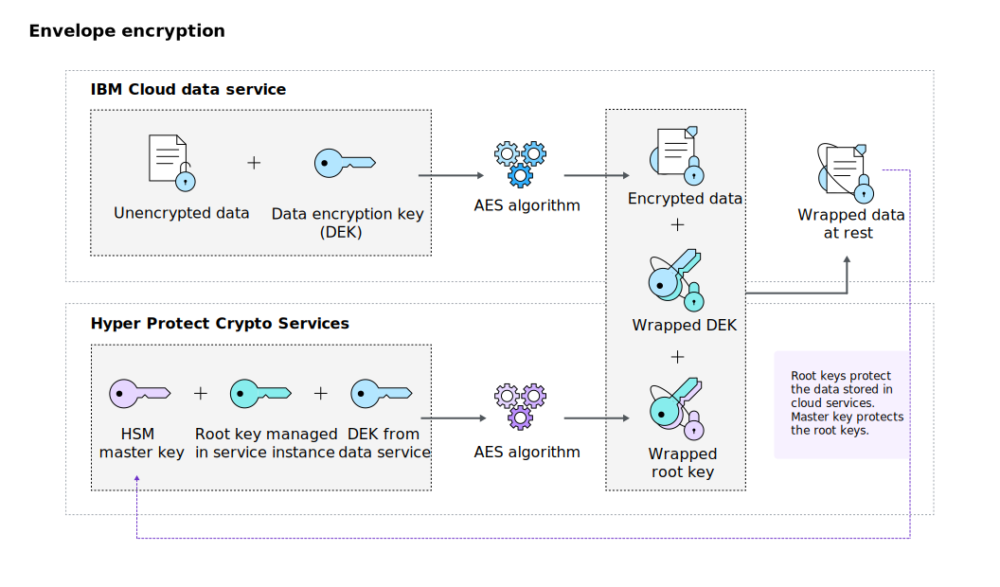
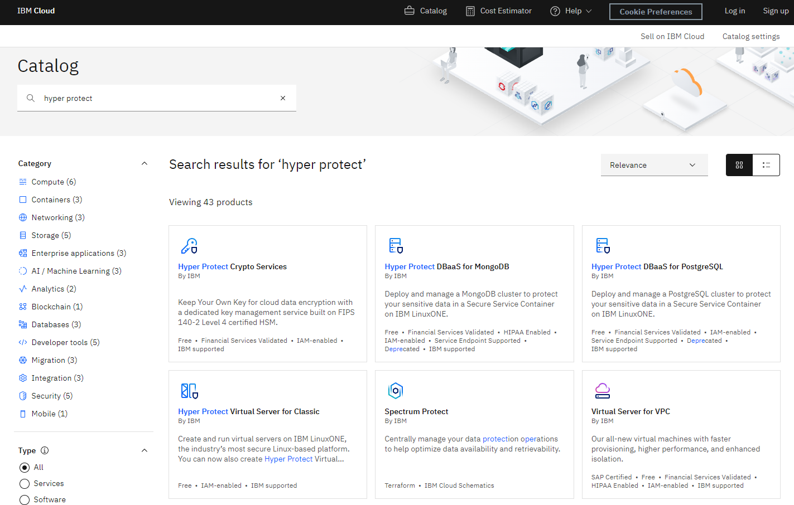

# Hyper Protect Crypto Services

IBM Cloud **Hyper Protect Crypto Services** provides you with exclusive control of your encryption keys in the highest security level. You can connect your Hyper Protect Crypto Services  instance to third-party keystores, and back up and manage keys across multiple clouds, including AWS, Azure, and more. 

!!! key "Key value"

    This is a dedicated key management service and _Hardware Security Module (HSM)_ that provides you with the **Keep Your Own Key** capability for cloud data encryption. Built on **FIPS 140-2 Level 4 certified** hardware, Hyper Protect Crypto Services provides you with exclusive control of your encryption keys.

!!! Important

    Unauthorized parties, including IBM Cloud admins, have no access to your encryption keys at any time. In cases where your application encrypts data with those keys, no other parties have access to your data.

## Video

See [IBM Cloud Hyper Protect Crypto Services overview](https://mediacenter.ibm.com/media/IBM%20Cloud%20Hyper%20Protect%20Crypto%20Services%20overview/1_1ipwq52p)

## Use cases

- [Manage VMware regulated workloads](https://cloud.ibm.com/docs/hs-crypto?topic=hs-crypto-manage-regulated-workloads#vmware-regulated-workloads)
- [Manage IBM Cloud Object Storage regulated workloads with Hyper Protect Crypto Services](https://cloud.ibm.com/docs/hs-crypto?topic=hs-crypto-manage-regulated-workloads#cos-regulated-workloads)
- [Encrypt Red Hat OpenShift on IBM Cloud routes](https://cloud.ibm.com/docs/hs-crypto?topic=hs-crypto-manage-regulated-workloads#openshift-regulated-workloads)

Also see [Use cases - Standard Plan](https://cloud.ibm.com/docs/hs-crypto?topic=hs-crypto-use-cases)

## Manage regulated workloads

With Hyper Protect Crypto Services, you have two options to encrypt your workloads:

- **Use the key management service**. For details, see [Bringing your encryption keys to the cloud](https://cloud.ibm.com/docs/hs-crypto?topic=hs-crypto-importing-keys) and [Protecting your data with envelope encryption](https://cloud.ibm.com/docs/hs-crypto?topic=hs-crypto-importing-keys).
- **Use the GREP11 and PKCS #11 APIs**. For more information about these two APIs and how they differ, see [Introducing cloud HSM](https://cloud.ibm.com/docs/hs-crypto?topic=hs-crypto-introduce-cloud-hsm).

##  Hyper Protect Crypto Services Integrations with IBM Cloud

!!! tip "Use"

    Explore: [Integrating IBM Cloud services with Hyper Protect Crypto Services](https://cloud.ibm.com/docs/hs-crypto?topic=hs-crypto-integrate-services) including:

    - [Storage service integrations](https://cloud.ibm.com/docs/hs-crypto?topic=hs-crypto-integrate-services#storage-integration): IBM Cloud Object Store, Block Storage for Classic VPCs.
    - [Database service integrations](https://cloud.ibm.com/docs/hs-crypto?topic=hs-crypto-integrate-services#database-integration): Elasticsearch, EnterpriseDB, etcd, MongoDB, PostgreSQL, Redis, RabbitMQ, Db2.
    - [Compute service integrations](https://cloud.ibm.com/docs/hs-crypto?topic=hs-crypto-integrate-services#compute-integration): Virtual Private Cloud, KMIP on VMWare, Entrust DataControl, Power Systems.
    - [Container service integrations](https://cloud.ibm.com/docs/hs-crypto?topic=hs-crypto-integrate-services#container-integration): Kubernetes, Red Hat Openshift.
    - [Ingestion service integrations](https://cloud.ibm.com/docs/hs-crypto?topic=hs-crypto-integrate-services#Ingestion-integrations): Cloud monitoring, Schematics, Event Streams.
    - [Security service integrations](https://cloud.ibm.com/docs/hs-crypto?topic=hs-crypto-integrate-services#security-service-integrations): App ID, Secrets Manager, Security and Compliance Center.
    - [Developer service integrations](https://cloud.ibm.com/docs/hs-crypto?topic=hs-crypto-integrate-services#devtools-integrations): Continuous Delivery

The following diagram illustrates the scene of integrating Hyper Protect Crypto Services with two services.

## Security and compliance

IBM Cloud® Hyper Protect Crypto Services has data security strategies in place to meet your security and compliance needs and ensure that your data remains protected in the cloud.

- [Security readiness](https://cloud.ibm.com/docs/hs-crypto?topic=hs-crypto-security-and-compliance#security-ready). 

    - **Data encryption**. Hyper Protect Crypto Services offers a dedicated hardware security module (HSM) to generate key material that you manage and perform envelope encryption operations. Hyper Protect Crypto Services also supports the management of your own HSM master keys. Built on FIPS 140-2 Level 4-certified HSMs, Hyper Protect Crypto Services offers the highest security level for cloud-based HSMs and stores cryptographic key material without exposing keys outside of a cryptographic boundary.
    - **Data deletion**. When you delete a key from Hyper Protect Crypto Services, the service marks the key as deleted, and the key moves to the Destroyed state. Keys in this state can no longer decrypt data that is associated with the key. 

- [Compliance readiness](https://cloud.ibm.com/docs/hs-crypto?topic=hs-crypto-security-and-compliance#compliance-ready)

    - [Common Criteria EAL4 certified](https://cloud.ibm.com/docs/hs-crypto?topic=hs-crypto-security-and-compliance#common-criteria-certified)
    - [FIPS 140-2 Level 4](https://cloud.ibm.com/docs/hs-crypto?topic=hs-crypto-security-and-compliance#fips)
    - [General Data Protection Regulation (GDPR)](https://cloud.ibm.com/docs/hs-crypto?topic=hs-crypto-security-and-compliance#gdpr)
    - [US Health Insurance Portability and Accountability Act (HIPAA)](https://cloud.ibm.com/docs/hs-crypto?topic=hs-crypto-security-and-compliance#hipaa-ready)
    - [IBM Cloud for Financial Services](https://cloud.ibm.com/docs/hs-crypto?topic=hs-crypto-security-and-compliance#fscloud-support)
    - [Information Security Registered Assessors Program (IRAP)](https://cloud.ibm.com/docs/hs-crypto?topic=hs-crypto-security-and-compliance#IRAP-support)
     - [ISO 27001, 27017, 27018](https://cloud.ibm.com/docs/hs-crypto?topic=hs-crypto-security-and-compliance#iso)
     - [SOC 2 Type 1](https://cloud.ibm.com/docs/hs-crypto?topic=hs-crypto-security-and-compliance#soc2-type1)

For more details, see [Security and compliance](https://cloud.ibm.com/docs/hs-crypto?topic=hs-crypto-security-and-compliance).

## Envelope encryption

Envelope encryption is the practice of encrypting data with a _data encryption key (DEK)_ and then wrapping the DEK with a _root key_ that you can fully manage. The root keys in Hyper Protect Crypto Services service instance are also wrapped and protected by the hardware security module (HSM) master key.

This key wrapping process creates wrapped DEKs that protect your stored data from unauthorized access or exposure. Unwrapping a DEK reverses the envelope encryption process by using the same root key, resulting in decrypted and authenticated data. Root keys that are managed in a Hyper Protect Crypto Services service instance are also encrypted by the master key that ensures you full control of the entire key hierarchy.

The following diagram shows a contextual view of envelope encryption.

For more details, see [Protecting your data with envelope encryption - Standard Plan](https://cloud.ibm.com/docs/hs-crypto?topic=hs-crypto-envelope-encryption).

## Try it out

Try out the service in the IBM Cloud: https://cloud.ibm.com/catalog/services/hyper-protect-crypto-services.

Follow the [Getting started tutorial](https://cloud.ibm.com/docs/hs-crypto?topic=hs-crypto-get-started).

## Explore the IBM Cloud Catalog

The IBM Cloud catalog [includes hyper protect](https://cloud.ibm.com/catalog?search=hyper%20protect&_gl=1*19ov0pj*_ga*MzIxMDU5Njc3LjE2OTIxOTgwODI.*_ga_FYECCCS21D*MTY5MjM4NTg5NC4xMC4xLjE2OTIzOTcwNDMuMC4wLjA.#search_results) products.

## Reference

- [Managing regulated workloads with Hyper Protect Crypto Services](https://cloud.ibm.com/docs/hs-crypto?topic=hs-crypto-manage-regulated-workloads)
- [Security and compliance](https://cloud.ibm.com/docs/hs-crypto?topic=hs-crypto-security-and-compliance)
- [Protecting your data with envelope encryption - Standard Plan](https://cloud.ibm.com/docs/hs-crypto?topic=hs-crypto-envelope-encryption)