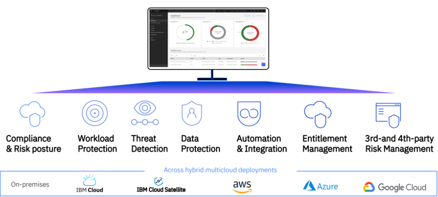
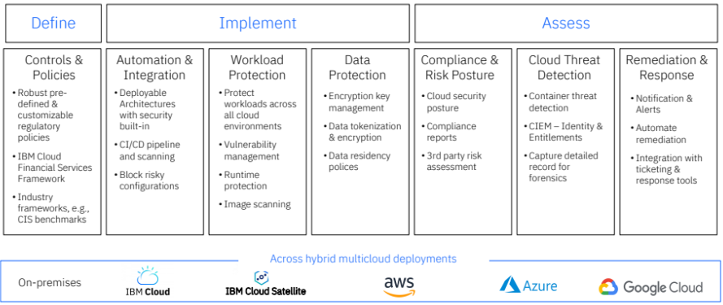
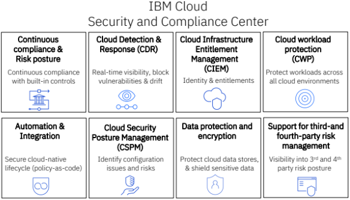

# IBM Cloud Security and Compliance

Address hybrid cloud, multicloud and containerized application security from code to cloud with a comprehensive _Cloud-Native Application Protection Platform (CNAPP)_ solution suite. Centrally manage your organization’s security, risk and compliance to regulatory standards, enable security and DevOps teams, secure sensitive data and protect workloads with real-time threat detection and vulnerability management.

## Pain points

Enterprise clients are spending more time and money to achieve their security and compliance objectives across hybrid multicloud environments.

- The average time to identify and contain a breach was 277 days.
- The healthcare industry reported the most expensive data breaches, at an average cost of $10.93 million (USD).
- Security AI and automation were shown to be important investments for reducing costs and minimizing time to identify and contain breaches. 

!!! important "Cost of a data breach"

    - $4.75million (USD) for breaches in public clouds
    - 82% of breaches involved data stored in cloud environments
    - 52% of breaches involved Personally Identifable Information (PII)
    - 1/3 breaches were identified by company security teams and tools
    - 2/3 breaches were identified by outsiders

## Concepts and terminology

- **Cloud-Native Application Protection Platform (CNAPP)**. A tightly integrated set of security and compliance capabilities designed to secure and protect cloud-native applications across development and production. CNAPPs consolidate container scanning, cloud security posture management, infrastructure as code scanning, cloud infrastructure entitlement management, runtime cloud workload protection, and runtime vulnerability/configuration scanning. CNAPP provides a holistic view of cloud security risks in one platform. CNAPP encompasses Cloud Security Posture Management (CSPM), Cloud Infrastructure Entitlement Management (CIEM), and Cloud Workload Protection Platform (CWPP). 
- **Cloud Security Posture Management (CSPM)**. CSPM is a technology that automates the identification and remediation of misconfigurations and security risks across diverse cloud environments and infrastructures, including Infrastructure-as-a-Service (IaaS), Platform-as-a-Service (PaaS), and Software-as-a-Service (SaaS). CSPM is used for risk visualization and assessment, incident response, compliance monitoring, and DevOps integration, and can uniformly apply best practices for cloud security to hybrid, multicloud, and container environments. Succinctly, CSPM tools continuously manage IaaS and PaaS security posture through prevention, detection and response to cloud infrastructure risks.
- **Cloud Infrastructure Entitlement Management (CIEM)**. Security offerings are specialized solutions focused on managing cloud access risk via administration-time controls for the governance of entitlements in hybrid and multicloud IaaS. CIEM helps enterprises to manage entitlements across all their cloud resources and mitigates the risk of data breaches. CIEMs also prevent excessive entitlements by continuously monitoring the permissions and activity of entities to ensure they’re operating within appropriate access controls, as well as recommend policy modifications to enforce least privilege access.
- **Cloud Detection and Response (CDR)**. CDR platforms provide consolidated visibility and data driven analytics to detect, investigate, and mitigate threats in the cloud. CDR is a proactive defense against cyber attacks that target cloud infrastructure and data. It involves the continuous monitoring of cloud systems for potential threats, the assessment of their severity, and the implementation of countermeasures to prevent or mitigate their impact. CDR systems log and analyze large volumes of data about accounts, privileges, configurations, and activity from applications 
and cloud services to provide insights, situational visibility, and alerts around risks and threats. 
- **Cloud Workload Protection Platform (CWPP)**. CWPP is a security solution that protects workloads (applications) across the software lifecycle, with capabilities for vulnerability management, configuration management for containers/Kubernetes, runtime security, and incident response.

The following diagram shows how Cloud-Native Application Protection Platform (CNAPP) provides a holistic view of cloud security risks in a single platform.

## IBM Cloud Security and Compliance Center

Optimized for hybrid multicloud environments

Achieve security and compliance across hybrid multiclouds as shown in the following diagram.

## Features

- **Cloud Security Posture Management (CSPM) across hybrid cloud, multicloud**. Visibility into cloud assets, identities (CIEM), misconfigurations and risks across hybrid cloud. Create multicloud environments with built-in industry-based compliance protocols for audit readiness.
- **Dedicated profile of controls for financial service**. Enable the IBM Cloud Framework for Financial Services, a set of control requirements designed to help clients address the security and regulatory compliance obligations of financial institutions.
- **Deployable architectures, support for toolchains and runtime Policy-as-Code**. Deployable reference architectures and support for policy management designed to help secure cloud-native application development and deployment.
- **Cloud Workload Protection Platform (CWPP) for critical workloads**. Secure containers, Kubernetes, OpenShift and hosts with out-of-the-box runtime security, container forensics and incident response, so you can better understand security breaches and your compliance needs.
- **Vulnerability management and cloud detection and response (CDR)**. Automate CI/CD pipeline, block vulnerabilities in before production and investigate suspicious activity with real-time visibility by detecting and prevent drift across applications.
- **Cloud Infrastructure Entitlement Management (CIEM) to manage permissions**. Gain visibility into cloud identities to manage permissions, identify inactive or excessive permissions, and optimize access policies to simplify meeting identity and access management security needs.
- **Data tokenization and encryption to protect sensitive data**. Protect data in cloud data stores and shield sensitive data with centralized encryption policies and auditing of data access across different data sources.
- **Support for third-and fourth-party risk management**. Visibility into third-and fourth-party risk posture with integration with GRC solutions for risk assessment and management.

## Solutions

Achieve security and compliance across hybrid multicloud through controls, policies, automation and integration, workload protection, and remediation and response:

- An integrated platform and centralized view (single dashboard) to manage security and compliance
- Support for across hybrid and multicloud environments
- Protects cloud environments from security risks, policy violations, misconfigurations and threats

See [IBM Cloud Security and Compliance Center](https://www.ibm.com/products/security-and-compliance-center) product page.

### IBM Cloud Secutity and Compliance Center

This solution is in the Security and Compliance Center suite that provides cloud posture management (CSPM) for IBM cloud resources and provides visibility in postures across hybrid cloud and multicloud environments. See [Security and Compliance Center Workload Protection](https://cloud.ibm.com/catalog/services/security-and-compliance-center-workload-protection?callback=/workload-protection/instance/postcreate&catalog_query=aHR0cHM6Ly9jbG91ZC5pYm0uY29tL2NhdGFsb2c/c2VhcmNoPSUyNTI3c2VjdXJpdHklMjUyMGFuZCUyNTIwY29tcGxpYW5jZSUyNTIwd29ya2xvYWQlMjUyMHByb3RlY3Rpb24lMjUyNyNzZWFyY2hfcmVzdWx0cw%3D%3D) in the IBM Cloud catalog.

### IBM Cloud Security and Compliance Center Workload Protection

This solution is in the Security and Compliance Center suite that provides centeralized cloud posture managment (CSPM), workload protection (CWPP) and more to protect workloads across hybrid cloud and multicloud environments. See [Data Security Broker - Manager](https://cloud.ibm.com/catalog/content/content-ibm-cloud-data-security-broker-77825f72-5c87-4b3e-97c0-09402db137a6-global) in the IBM Cloud catalog.

## Next steps

To get started, sign in to your IBM Cloud account to [Manage the security and compliance of your workloads](https://cloud.ibm.com/security-compliance/overview).

## References

- [IBM Security and Compliance Center](https://www.ibm.com/products/security-and-compliance-center) product page
- [IBM Cloud Security and Compliance Center Data Security Broker](https://www.ibm.com/products/data-security-broker)

### IBM Partners

- Learning plan [IBM Cloud Security and Compliance Center (SCC) Level 2](https://yourlearning.ibm.com/activity/PLAN-7D82EAEDC78C)
- [IBM Security and Compliance Center Suite](https://ibm.seismic.com/Link/Content/DCB67p3cG4T66GTMW4Bq4XJ82bFP) Sales Kit