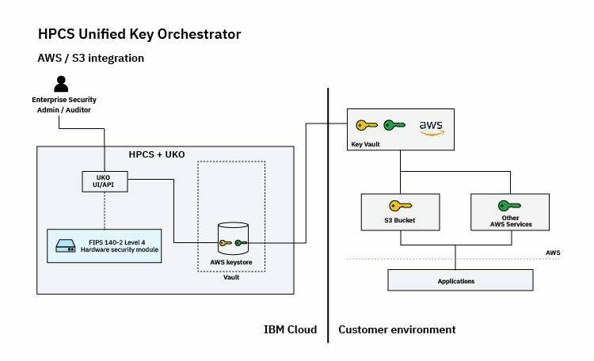
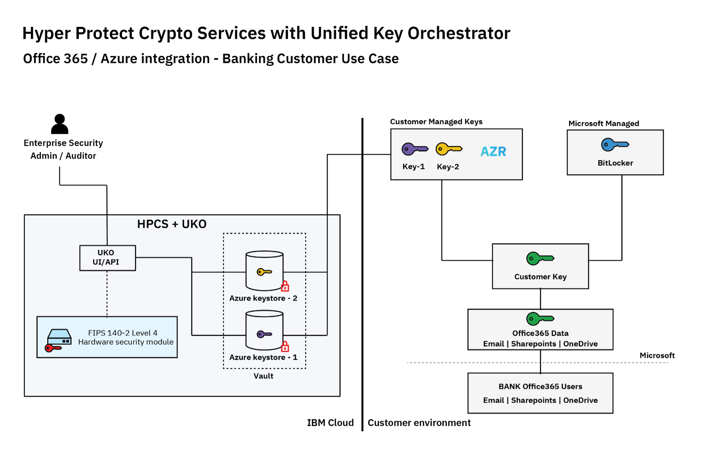
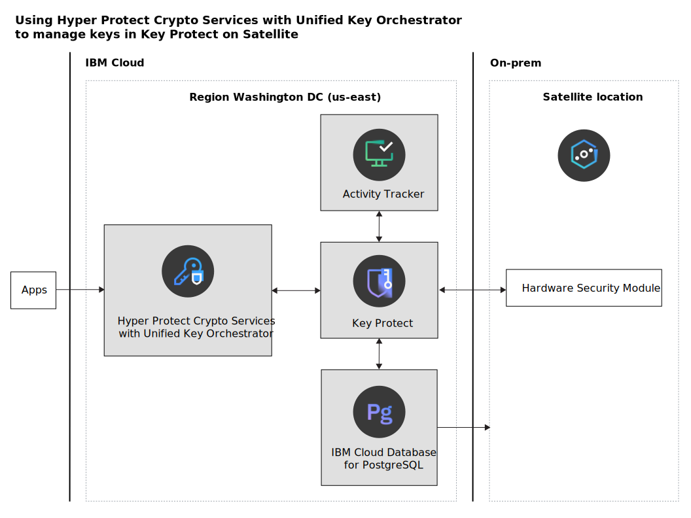

# Unified Key Orchestrator

Managing keys in silos on-premises and across multiple clouds brings up challenges around demonstrating compliance, ensuring the right security posture with key usage and maintaining data governance and sovereignty. A [Gartner report](https://www.gartner.com/en/documents/3991120/develop-an-enterprisewide-encryption-key-management-stra) suggests that security and risk management leaders must develop an enterprise-wide encryption key management strategy or lose the data.

!!! tip "Use"

    Built on the _Keep Your Own Key_ technology, **Unified Key Orchestrator** helps enterprises manage their data encryption keys across multiple key stores across multiple clouds environments, including keys managed on:
    
    - On-premises
    - IBM Cloud
    - AWS
    - Microsoft Azure
    - Microsoft 365

## Features

The Unified Key Orchestrator solution has been developed to address these pain points and provides the following:

- **A single control plane for all your keys**: The Unified Key Orchestrator has a UX research-led UI design that helps enterprises meet their compliance control obligations. The user experience is engineered to be seamless for key administrators, hides the complexities and differences across different keystone implementations and helps reduce risk of incorrect key usage.
- **Key lifecycle management features based on [NIST recommendations](https://csrc.nist.gov/publications/detail/sp/800-57-part-1/rev-5/final)**:

    - Keys will never be in the clear anywhere. They are protected by your own master key on the service’s HSM (hardware security module).
    - Provides secured transfer of keys to internal keystores in the service instance or external keystores including Microsoft Azure Key Vault (Office365®) and AWS KMS.
    - Distributes and installs keys with a single click. Manages keys and keystores through RESTful API.
    - Centrally backs up and manages all keys of your enterprise and redistributes keys to quickly recover from errors due to lost keys.

- **Help reduce total cost of ownership and operational costs**: The Unified Key Orchestrator provides a single intuitive tool with a tiered pricing model designed to reduce the complexity and cost of managing multiple key management systems. Additionally, customers can use the API to plug the Unified Key Orchestrator into their DevOps process to integrate key management when they deploy workloads to the cloud.

## Getting started

This section points you to tutorials on how to use Unified Key Orchestrator for:

- AWS 
- Azure and Microsoft 365
- Cloud Satellite

### With AWS

See [Securely manage AWS S3 encryption keys with IBM Cloud Hyper Protect Crypto Services with Unified Key Orchestrator](https://developer.ibm.com/tutorials/securely-manage-aws-s3-encryption-keys-with-ibm-cloud-hyper-protect-crypto-services-with-unified-key-orchestrator/?_gl=1*1rrqi9j*_ga*MzIxMDU5Njc3LjE2OTIxOTgwODI.*_ga_FYECCCS21D*MTY5MjM4NTg5NC4xMC4xLjE2OTIzOTgwNzkuMC4wLjA.)

The following diagram illustrates the architecture.

### Microsoft 365

This tutorial focuses on using IBM Cloud Hyper Protect Crypto Services with Unified Key Orchestrator to manage the regulatory compliance requirements of company data in a Microsoft 365 environment on Azure with Azure Key Vault and Azure Active Directory.

See [Manage regulatory compliance of company data in Microsoft 365 with Hyper Protect Unified Key Orchestrator](https://developer.ibm.com/tutorials/manage-regulatory-compliance-of-company-data-in-microsoft-office-365-in-azure/?_gl=1*1dmhv82*_ga*MzIxMDU5Njc3LjE2OTIxOTgwODI.*_ga_FYECCCS21D*MTY5MjM4NTg5NC4xMC4xLjE2OTIzOTgyMzUuMC4wLjA.)

The following diagram illustrates the use case.

### IBM Cloud Satellite

[IBM Cloud Satellite](https://cloud.ibm.com/docs/satellite?topic=satellite-getting-started) provides you with flexibility and scalability to bring your own infrastructures to IBM Cloud. You can run IBM Cloud services anywhere including on your on-prem data centers and other cloud providers. With IBM Cloud Satellite, you can connect your multiple environments to implement distributed cloud solutions to help your enterprise hybrid cloud transformation. 

Key Protect on Satellite allows you to fully control your encryption keys by using your on-prem hardware security module (HSM). Hyper Protect Crypto Services with Unified Key Orchestrator enables you to manage keys in various key management systems, including Key Protect on Satellite, from a single pane of glass.

See [Using Hyper Protect Crypto Services with Unified Key Orchestrator to manage keys in Key Protect on Satellite](https://cloud.ibm.com/docs/hs-crypto?topic=hs-crypto-tutorial-uko-satellite).

The following diagram illustrates the use case:

## References

- [Announcing Multicloud Key Management with IBM Cloud Hyper Protect Crypto Services](https://www.ibm.com/blog/announcement/announcing-multicloud-key-management-with-ibm-cloud-hyper-protect-crypto-services/)
